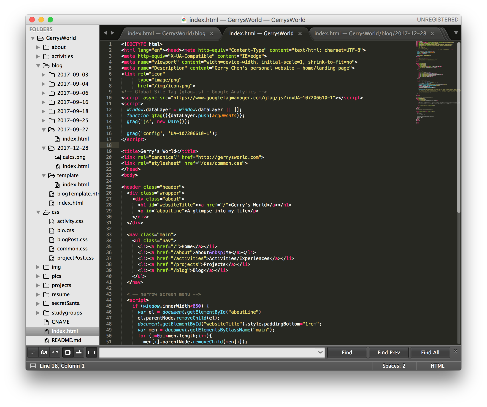
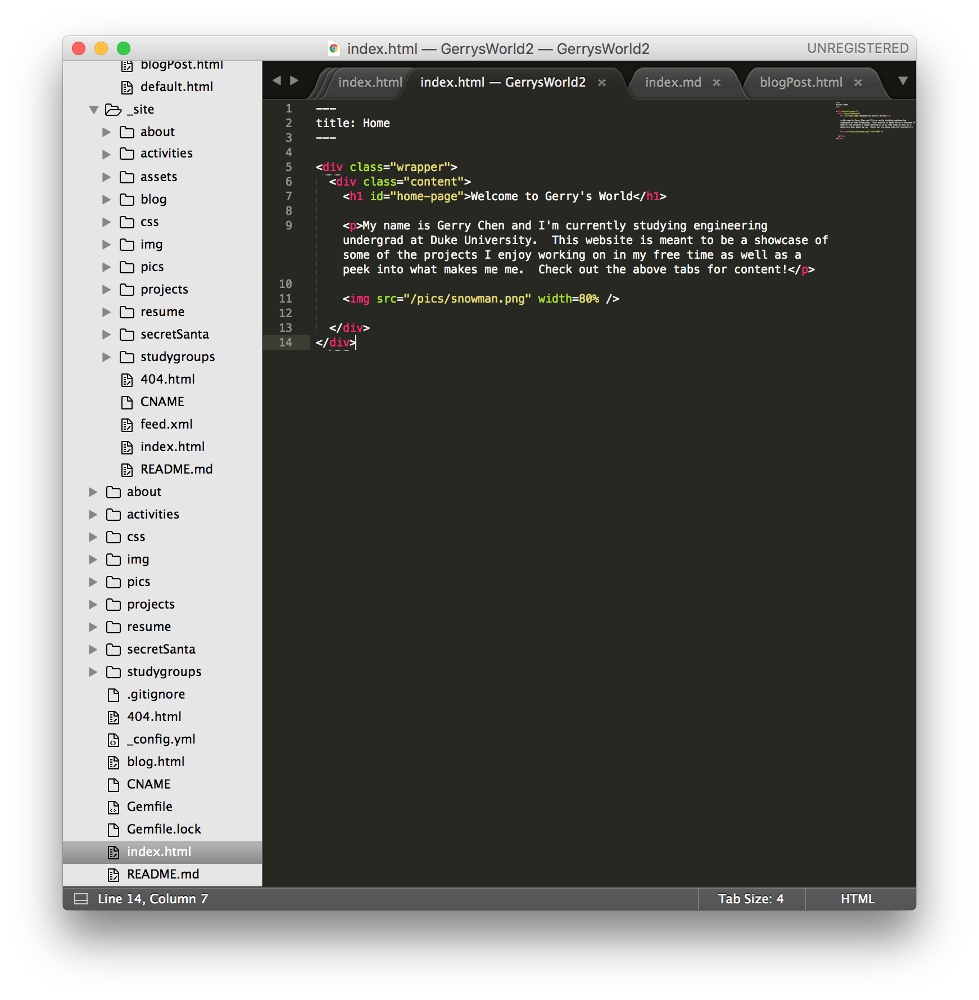

## Intro
Previously, I had manually coded every single html page on the site, meticulously updated the links, and maintained the directory structure.  That was tedious!  Initially, I didn't expect the site to have more than a few pages.  Due to the fact that dynamic web pages are much more expensive to host (and perhaps to write), I opted with an all-static website, but as I kept wanting to add features, I decided it was time to stop playing around and do things better.
## Jekyll
Jekyll calls itself <q>a simple, blog-aware, static site generator</q>.  In other words, it helps you generate a static site.  It has layout engine tools built-in, meaning you can write "template" html files with variable blocks and have Jekyll automatically insert the content for you.  That way, all the repetetive html code that clutters up your code gets cleaned up.  Compare, for example,
<table>
<tr><td align="center"> this old mess... </td><td align="center"> vs. this new, clean code! </td></tr>
<tr>
	<td>  </td>
	<td>  </td>
</tr>
</table>

They produce the exact same page!  Of course, there's countless different softwares, packages, frameworks, etc that can probably accomplish similar tasks.  To be honest, the scope of what I wanted to do/improve was actually small enough that I probably could have written my own command line script in relatively short time to do what I wanted, but I saw this as an opportunity to become familiarized with the popular tools and techniques available.  It paid off - now I have some familiarity with not only Jekyll, but also Liquid and Markdown - 2 "languages" which Jekyll supports.  With a large user base, Jekyll had ample resources available to answer any questions I had.

## The Process
I won't go into too much detail here because it's currently 6AM, but the gist of process was to first set-up the Jekyll project, then make the appropriate html templates, and finally to slowly transition pages to the new, updated format.

#### Setting up
The beginning of this process was admittedly quite frustrating because at some point many years back, I had done something strange with my Ruby installation trying to install Homebrew.  After having sorted out and installed the latest Ruby, gem, and Jekyll versions, however, getting started with Jekyll was a breeze.  Typing

<code>jekyll new __directoryname__</code>

was all that was needed to set up a minimum working example, runable via the command

<code>jekyll serve</code>

I started by copying my old website code into the root directory of the new Jekyll project folder and already the site was up and working again!  The great thing about Jekyll is that it's actually just an extension of html which means that any html files will run without the need for any modification.  After editing the configuration file and adding a couple folders, I was ready for the next step.

#### Making HTML templates
This process could definitely have taken a very long time and a great deal of thought to properly organize and plan for the future.  Since the templates were relatively easy to modify (and the content being the time-intensive one to change) though, I decided to just copy-paste a couple pages and remove the content to use as templates.  For example, I just copy-pasted my homepage and removed the body to use as a template for most of my pages.  Similarly, I took the html from one of my blog posts to use as a template for the rest.  I separated some less obvious code chunks (like the Google analytics script) and put them into different files as well to try to make things cleaner and clearer.  There's still more I'll probably want to tweak, but things are working fine for now.

#### Converting pages
This was definitely the most time consuming process.  Because I had basically hacked together the site when I first wrote it, some things were very unclear and poorly designed which meant it wasn't really feasible to just use advanced find/replace tools (i.e. the multifile, regex supported one that Sublime uses) to strip files of all but their content.  Some files had different Google analytics tags, css dependencies, arbitrary line breaks, metadata, etc which would have made it a nightmare to automatically convert.  I figured, since I really only have 20ish pages on the site and several of them don't even really need to be converted (remember Jekyll accepts HTML), I would just restructure things manually.  It took me probably 4 hours or so, but I think the amount of brain exercise and learning that came from the experience is worth it.  Next time I feel confident that I will know how to more efficiently structure things and quickly convert pages using more automated processes.

## Conclusions
The full code for the website is available on <a href="https://github.com/gchenfc/gerrysworld2">github</a>.  All in all, Jekyll was a very pleasant experience and the next time I make a website, I feel content that Jekyll is now in my toolbox.  If I get a chance, though, I'd also be interested in exploring some other CMS's seeing as there seem to be dozens of very well made tools such as Kirby and Perch which, no-doubt, would be better suited for different tasks.