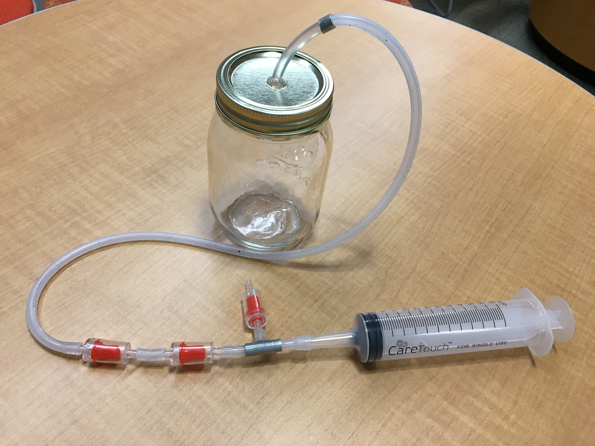
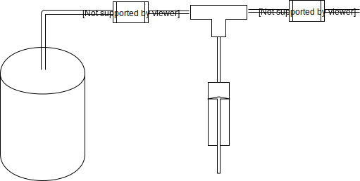
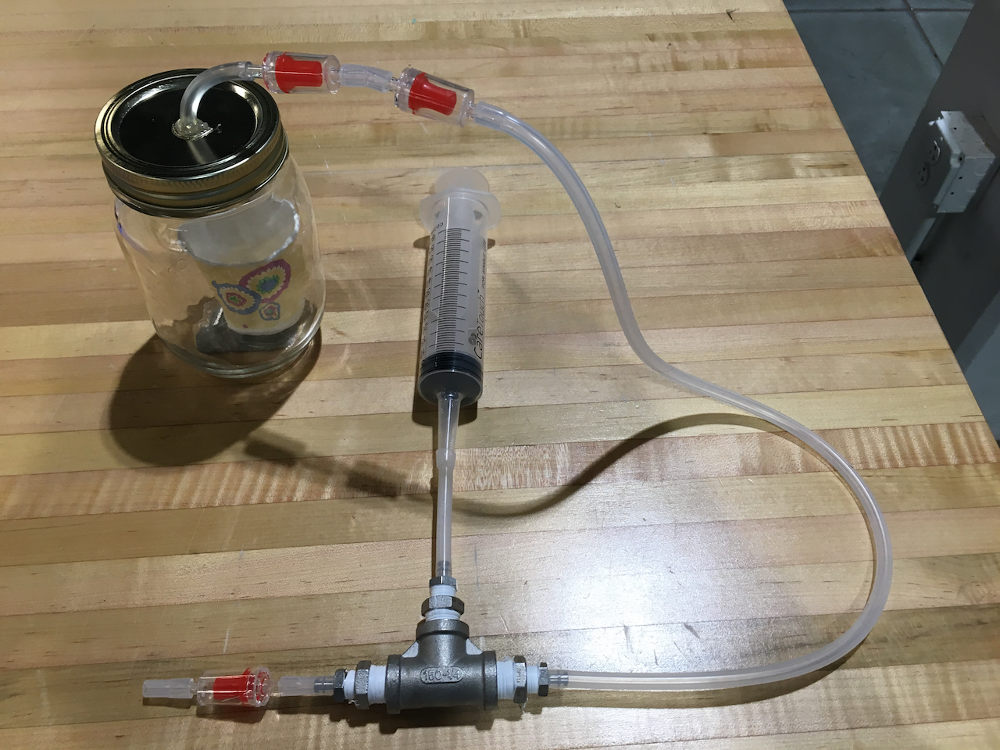
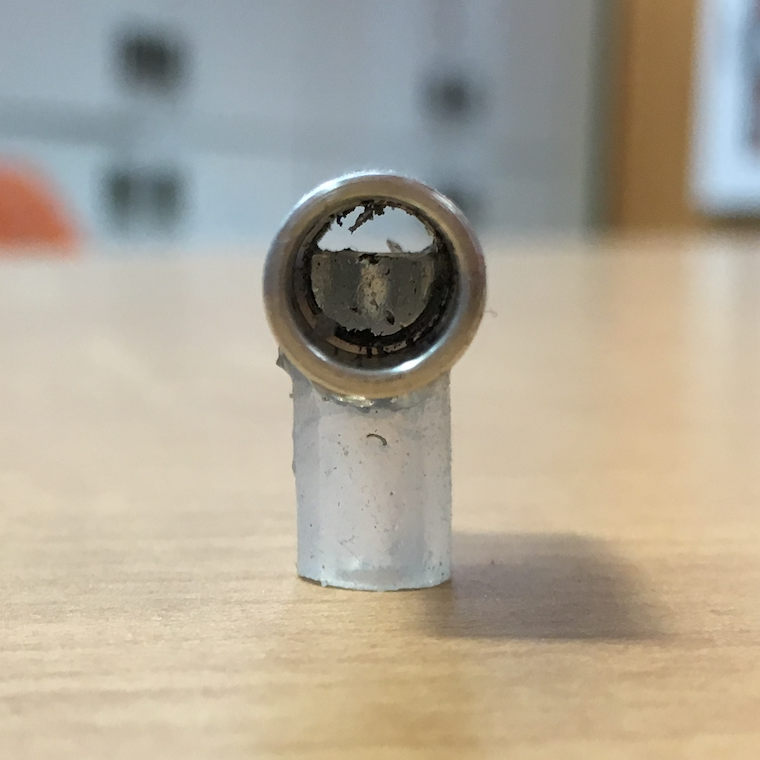
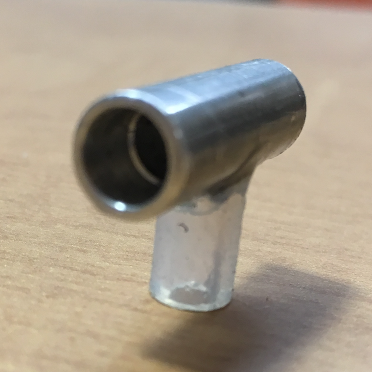
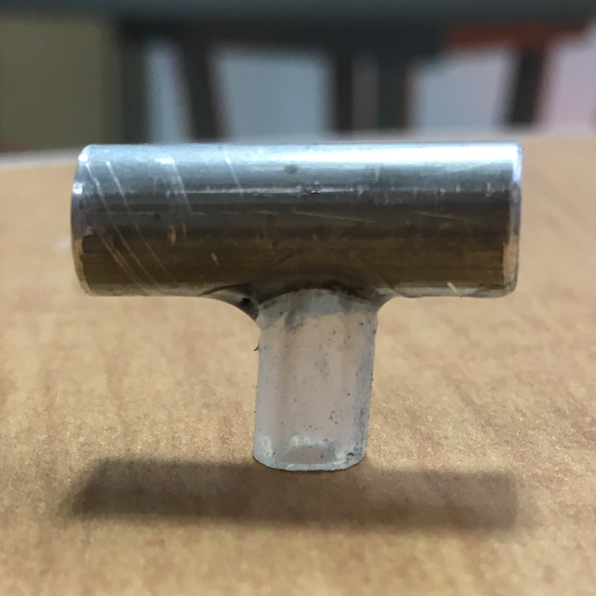
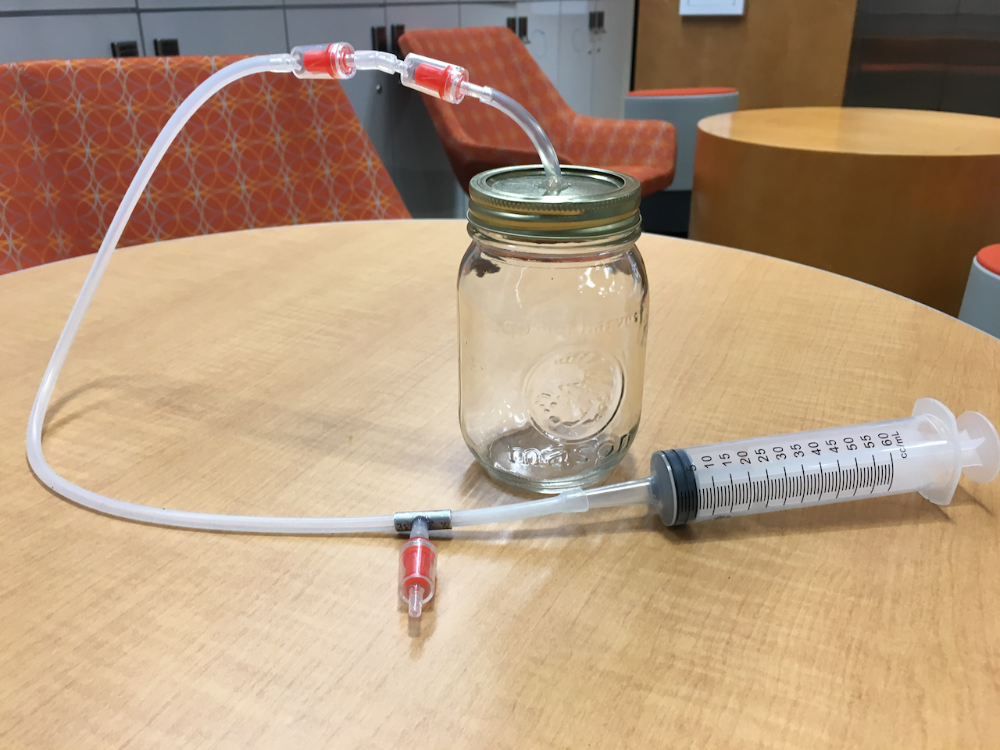

## Intro
For the Biophotonics lab work with Brenton Keller and Mark Draelos, I need to mass-make anatomically accurate cornea molds.  To do so, the silicon mold compound I use must be vacuum degassed to remove any air bubbles.  I had been using a standard vacuum pump but it was a bit noisy, clunky, and belonged to a different club on campus.  I'd slowly been ruminating a design for a hand-powered vacuum pump for a couple months on and off and slowly acquiring some parts.  Finally, I had the time today to put it all together.  It was very successful drawing a sufficient vacuum for the silicon mold compound to degas which requires -29inHg.  That's just .02bar absolute!  I'm still working on getting a gauge to measure the exact pressure.

## General Design
The vacuum chamber consists of a mason jar with vinyl tubing coming through a hole in the lid.  The tubing goes to a one-way valve which then goes to a tee with one end going to another one-way valve and the other end going to a syringe.  The diagram below illustrates how the connections are made.

The left valve allows air to be pulled out of the mason jar when the syringe is drawn while the right allows sucked air to be expelled when the syringe is depressed.  Together, simply pumping the syringe as one would pump a bicycle tire gradually sucks the air out of the mason jar producing a vacuum.

## Materials
In all, this project cost me only a couple dollars for the valves and jar because I happened to have all the other materials handy.  In all, though, I'd say the project would cost around $15 from scratch and consists of the following materials:

* Mason Jar - $2 for 12 at Dollar General
* 1/4" flexible tubing - $3 for 20 feet at [Lowes](https://www.lowes.com/pd/EASTMAN-1-4-in-x-20-ft-Pvc-Clear-Vinyl-Tubing/1000180535)
* Aquarium One-Way Valves - $6.50 for 10 at [Amazon](https://www.amazon.com/gp/product/B01MEDMAJQ/ref=oh_aui_detailpage_o04_s00?ie=UTF8&psc=1)
* Syringe - $7.50 for 5 at [Amazon](https://www.amazon.com/60ml-Catheter-Disposable-Syringe-Covers/dp/B01LWX4FEC/ref=sr_1_1?s=industrial&ie=UTF8&qid=1515989505&sr=1-1&keywords=60+ml+syringe) (bigger=better, 10mL didn't really work)
* 1/4" Tee (barbed) - $8.33 for 10 at [Amazon](https://www.amazon.com/Eldon-James-T0-4NN-Natural-Nylon/dp/B017UXJGDG/ref=sr_1_2?s=industrial&ie=UTF8&qid=1515989570&sr=1-2&keywords=tee+barb+1%2F4)

Together, that comes out to around $27, but this is enough materials for like 10 vacuum chambers (well, you'd need more syringes, but still).  I intentionally selected item listings which were a reasonable balance between small-volume and low unit cost, but you can definitely find smaller quantities of many items for cheaper.  If you made 10, each would cost less than $4.

## Assembly Instructions
Assembly is pretty straightforward - just drill a hole in the lid of the mason jar and super glue/hot glue some tubing into the hole.  Then just connect everything else according to the diagram above.  The barb fittings make the connections easy and they're more than secure enough for just atmospheric pressure.  Depending on the quality of valves you get, you may want to daisy chain multiple together "in series".  "Check valves" are supposedly better, but I think most listings use some deceiving marketing so you'll have to rely on other information to determine the quality of valves.  I just bought cheap ones and daisy chained them and they work fine.

## My 1st Build
The first go, I used the only tee I had lying around and had to use a mess of adapters.  I also initially only used one valve for each direction (as in the diagram) but switched to two in a line on the mason-jar-side of the tee when I noticed the valve failing.  Two in a line worked a charm.  The resulting device worked fine.

One of the issues I noticed was that by the fourth or fifth pump, I couldn't really draw any more vacuum.  I figured the reason was because there was so much volume in the tee that the syringe wasn't big enough to draw more air out.  After each push, the air inside the tee is essentially at atmospheric pressure.  If the volume inside the syringe is about equal to the volume in the tee, then fully pulling the syringe would result in the pressure approximately halving according to the ideal gas law.  That means you can only ever attain .5bar!  That's pretty bad.  In response, I fashioned my own makeshift tee from an aluminum rod.

## My 2nd Build
I didn't want to wait for a tee to arrive in the mail nor did I want to make a trip to the local home depot (it's not easy when living on campus!).  I instead found some aluminum rod stock lying around which was approximately 3/8" in diameter and had a 3/16"-ish hole down the middle.  How lucky!  I cut a ~3/4" piece off and widened the holes a bit on the ends using a drill press to fit the 1/4" tubing.  I also drilled a hole perpendicular down the middle to finish the tee.  I superglued the tubing for the stem of the tee since it wasn't as snug as the other two joints and called it a day.  It was a fine substitute for a correctly sized tee.  This significantly increased the suction abilities.

<a href="v2.png"><a href="v3.png">

## My 3rd Build
Finally, I was a bit annoyed by the length of tubing between the two check valves and the tee, but I wanted them there to allow flexibility so that the jar wouldn't topple over when pumping.  I decided to just make a quick female-female connector between the mason jar and check valves so that the flexibility could be put there instead and I could shorten the distance between the check valves and tee.  This was mostly just an oversight when I hot glued the tubing to the mason jar lid but the connector has the additional advantage of easily relieving the pressure by pulling out the tubing at the connector rather than at the (relatively delicate) valve.  The ratio in depressed-syringe and drawn-syringe volumes is sufficiently small to allow a very strong vacuum to be formed.  I will try to quantitatively measure it at my earliest convenience.

<a href="v3.png"><a href="v3.png">

## \*\*\*UPDATE\*\*\* 1/18/2018
I just realized you can daisy chain multiple vacuum syringe apparatusses to improve the vacuum.  By setting the exhaust of a second-stage vacuum system as another, weaker, vacuum, the second-stage vacuum can be drawn much lower.  This allows weaker valves and poor "expansion ratios" to be joined together to create better vacuums.  I'm sure this is how very high-performance vacuums and compressors must work.  The only limit to the ability of the vacuum is the resistance of the jar and tubing to resist the vacuum which should be no issue since the maximum pressure differential is only 1atm ~15psi.  I haven't yet tested this because I don't have the need nor a gauge, but I can't see why this wouldn't work other than the hassle of having to switch back and forth between pumping the syringes.
## Future Plans
To be perfectly honest, this works just fine for me and I can't really imagine scenarios where (a) this would be insufficient and (b) the application wouldn't warrant buying a real vacuum chamber/pump.  This is meant to be a quick/dirty tool to play around with and, as such, it works great.  I think small improvements which I would reasonably make include
* getting a vacuum pressure gauge or putting a positive pressure gauge inside the chamber
* buying real tee's which will have smaller interval volume due to hugging the tube from the inside rather than the outside
* getting a bigger syringe, preferably with a smaller nozzle volume
* better securing the tube coming out of the mason jar
* getting a bigger mason jar??? (could this be dangerous?)