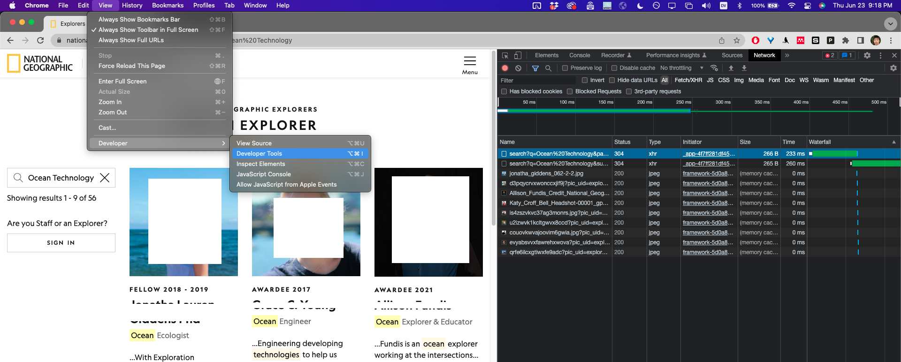
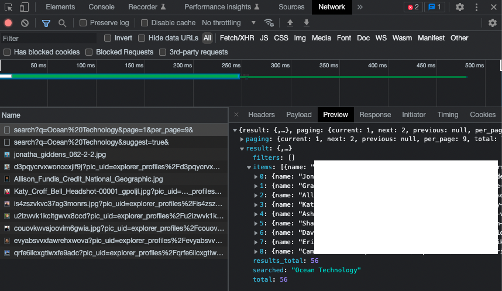
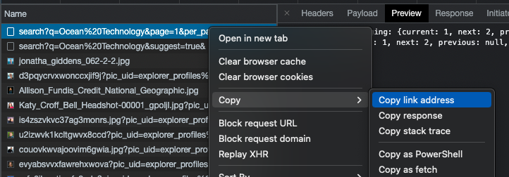

<style>
  code {
    background-color: #eee
  }
  pre {
    line-height: 0;
  }
  pre > code {
    font-size: 10pt;
    line-height: 1.1;
    background-color: transparent;
  }
  code > *  {
    line-height: 0;
  }
</style>

<div class="wrap-collabsible">
  <input id="collapsible" class="toggle" type="checkbox" checked> <!-- delete "checked" to default to unchecked -->
  <label for="collapsible" class="lbl-toggle">Table of Contents</label>
  <div class="collapsible-content">
    <div class="content-inner" markdown=1>

- [Introduction](#introduction)
    - [Problem Statement](#problem-statement)
- [Code](#code)
- [How to / My Process / Walkthrough](#how-to--my-process--walkthrough)
  - [Perform a search](#perform-a-search)
  - [Extract details from a page](#extract-details-from-a-page)
  - [Putting it together and exporting as CSV](#putting-it-together-and-exporting-as-csv)
- [Summary](#summary)

</div>
  </div>
</div>

# Introduction
My girlfriend is interning for Nat Geo and wanted some help scraping the data from their [Explorers Directory](https://www.nationalgeographic.org/find-explorers) into a csv file.  We figured it would be faster/easier for me to do it, and also I welcome the practice :)

Follow along with me for a crash-course into basic data scraping :)

### Problem Statement

1. Execute a search query on the [Explorers Directory](https://www.nationalgeographic.org/find-explorers)
2. For each result, "click" on the link and pull out the useful properties (i.e. Scientific Disciplines, Technical Disciplines, etc.)
3. Save all the names / properties into a csv.

# Code

Minimal Version: [](https://colab.research.google.com/drive/1fzuLBpn62fBH_21KlgpfFEww7ADfQymz#scrollTo=H56_GWT9mSGs)

More complete, annotated version: [](https://colab.research.google.com/drive/1bhnXIwKtU0Q5TxK6-VXDFf3spMANOaTi#scrollTo=ZD8lQI87JhaX) or see the embedded gist:

<script src="https://gist.github.com/gchenfc/312733319af43709306264b794ea4241.js"></script>

# How to / My Process / Walkthrough

The data scraping process for this particular task involves 2 steps:
1. Perform a search
2. Extract details from a page.

Let's start with doing the search

## Perform a search
First, manually do the search.

1. Go to the [search page](https://www.nationalgeographic.org/find-explorers) on Google Chrome
2. Open up the "Developer Tools": `View -> Developer -> Developer Tools` (See Screenshot)
3. In the Developer Tools window, Switch to the "Network" tab.
4. Execute a search, and you should see stuff start popping up in the "Network" Tab.



Now if we take a closer look at the data that got sent to us from the server / loaded by the browser (by clicking on each entry and clicking the "Preview" tab), we see that most of the data is just images (of the profile pictures), but one of the data contains a bunch of metadata about the search results!  Perfect!



Now that we know what to look for, let's try to load that data manually without Google Chrome.  Right-click on the "Name" of the request (in this case, "search?q=Ocean%20Technology...") and select "Copy link address" (see screenshot).



And let's try downloading the same data except in python:

```python
import requests
results = requests.get('https://www.nationalgeographic.org/find-explorers/api/explorers/search?q=Ocean%20Technology&page=1&per_page=9&')
print(results.json())
```
Result:
```
{'result': {'items': [
      {'name': 'REDATED',
        'details': '/explorers/details/REDACTED',
        'slug': 'REDACTED',
        'field_of_work': ['Ocean Ecologist'],
        ...
      }
    ], 'filters': [], 'searched': 'Ocean Technology', 'results_total': 56, 'total': 56
  }, 'paging': {'current': 1, 'next': 2, 'previous': None, 'per_page': 9, 'total': 7
  }
}
```
Success!  Now we can print out all the results, for example:
```python
for person in results.json()['result']['items']:
    print(person['name'])
```
```
Jonatha XXXXX
Grace XXXXX
Allison XXXXX
Katy XXXXX
Asha XXXXX
Shah XXXXX
David XXXXX
Erika XXXXX
Camrin XXXXX
```

The last thing we notice is that we only got 9 results.  We might notice, though, that the search url has an extra query string at the end for `per_page=9`.  We can just change this to `per_page=10000` to get all the results.  And finally, we can make our python search more readable if we want, by adding the query strings to the `requests.get` kwarg:
```python
results = requests.get('https://www.nationalgeographic.org/find-explorers/api/explorers/search',
                       params={'q':'Ocean Technology', 'per_page':10000})
people = results.json()['result']['items']
```

## Extract details from a page

If we manually click on one of the search results in Google Chrome, we see that the url looks like:

`https://www.nationalgeographic.org/find-explorers/xxxxxx`

where `xxxxxxx` is the person's name separated by dashes.

For each of the search results from python, we also notice that there's a field called "slug" that looks suspiciously similar.  Sure enough, the link to each individual person's page is:

`https://www.nationalgeographic.org/find-explorers/[[slug]]`.

Now in this case if we just download the whole html page:

```python
import requests
html_page = requests.get('https://www.nationalgeographic.org/find-explorers/[[slug]]')
print(html_page.content)
```
and we get a big giant HTML page:
```
<!DOCTYPE html>
<html lang="en">
<head>
  ...
</head>
<body>
  <div id="__next" data-reactroot="">
    ...
  </div>
  <script id="__NEXT_DATA__"
    type="application/json">{"props":{"pageProps":{"slug":"xxxxxxxx","details":{"name":"XXX","bio":"XXX","pic":"XXX","pic_credits":"XXX","scientific_disciplines":["Anthropologist (Biological)"],"technical_disciplines":["Adventurer","Artist","Researcher"],"fields_of_study":[],"field_of_work":["Primatologist"],"self_described_disciplines":"Primatologist",...}</script>
</body>
</html>
```

Notice that at the very bottom of the page, this contains all the info we want!!!

Tip: in general, try ctrl-f a string from the actual webpage that you care about, e.g. "Anthropologist (Biological)" and it should bring you to where you care about.

Although we could use something like [Beautiful Soup](https://beautiful-soup-4.readthedocs.io/en/latest/) to parse the HTML page, here we can do something simple and just manually trim the string to only contain the part that we care about:

```python
page = results.content.decode()
start_index = page.find('{"props":')
end_index = page.find('</script></body>')
import json
data = json.loads(page[start_index:end_index])
print(data)
```
```
{
  "props": {
    "pageProps": {
      "slug": "xxxxxxxx",
      "details": {
        "name": "XXX",
        "bio": "XXX",
        "pic": "XXX",
        "pic_credits": "XXX",
        "scientific_disciplines": [
          "Anthropologist (Biological)"
        ],
        "technical_disciplines": [
          "Adventurer",
          "Artist",
          "Researcher"
        ],
        "fields_of_study": [],
        "field_of_work": [
          "Primatologist"
        ],
        "self_described_disciplines": "Primatologist"
      }
    }
  }
}
```

The data we want is contained in `data['props']['pageProps']['details']`!!!  Yay!

```python
import json
def get_data(html_page):
    page = html_page.content.decode()
    start_index = page.find('{"props":')
    end_index = page.find('</script></body>')
    data = json.loads(page[start_index:end_index])
    return data['props']['pageProps']['details']
```

## Putting it together and exporting as CSV

Now we just have to put everything together.

1. Perform the search
2. Load the details for each search result
3. Save the results in a csv file

[](https://colab.research.google.com/drive/1fzuLBpn62fBH_21KlgpfFEww7ADfQymz#scrollTo=H56_GWT9mSGs)
```python
import requests
import json
import pandas as pd

# Perform the search
results = requests.get('https://www.nationalgeographic.org/find-explorers/api/explorers/search',
                       params={'q':'Ocean Technology', 'per_page':10000})
people = results.json()['result']['items']

# Load the details for each person in the search result
all_data = []
def get_data(html_page):
    page = html_page.content.decode()
    start_index = page.find('{"props":')
    end_index = page.find('</script></body>')
    data = json.loads(page[start_index:end_index])
    return data['props']['pageProps']['details']

for person in people:
    print('loading {:}'.format(person['name']))
    raw_html = requests.get('https://www.nationalgeographic.org/find-explorers/{:}'.format(person['slug']))
    data = get_data(raw_html)
    all_data.append(data)

# Export to csv
data = pd.DataFrame(all_data)
data.to_excel('data.xlsx')
data.to_csv('data.csv')
# display(data)
```

# Summary
We walked through the process of:
1. How you can use Google Chrome's "Network Analyzer" in "Developer Tools" to figure out what API request to use to search on our desired site,
2. How to download an html page and parse for the information we want
3. Export the data in excel or csv format.

Let me know what you think in the comments at the bottom of the page :)
