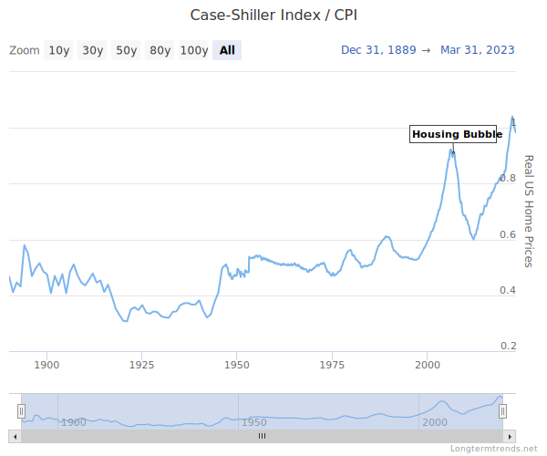

Disclaimer:

First, realize that I am no where close to being an expert.  I just like trying to figure things out from "first principles" to better understand the intuition behind how the world works.  Is any of this accurate?  Who knows, but I think it seems pretty logical.

Read on and decide for yourself - I'd love to hear your thoughts!  (leave a comment at the bottom of the page or shoot me an email/text).

---

**Punchline: Historically, home property values haven't appreciated in the long-term.**

---

I woke up early this morning due to jetlag, and was thinking about buying vs renting a house/property.

First recognize that the return on investment of buying a house comes from 2 sources: (1) rental income and (2) property appreciation.  Previously, I ignored property appreciation assuming it would average to zero, but following a discussion with my sister & her husband a few weeks ago, I realized this is not a given.  This morning when I woke up, I felt like googling it.

Random: A house **always** *depreciates* in value (due to structural wear), it's only the land the house is built on that could appreciate. (Not that it's particularly useful to think of things that way, but I thought it was pretty interesting.)

## Single-family home prices over time

First, this is kind of a neat plot: inflation adjusted average single-family home price over time in the US:
[link](https://www.longtermtrends.net/home-price-vs-inflation/).

(screenshot of inflation-adjusted housing price over time in the US:)

## Observations

1. housing price is not strongly correlated with population growth.  Compare to e.g. US population from wikipedia, showing enormous and steady growth over past 2 centuries: 
2. housing price in 2000 was about the same as housing price in 1892, aka housing price had not significantly increased over that century
3. after the 2008 bubble, housing price returned to 2000 level, and housing price peaked one year ago even higher than in 2008.  Note that the primary driver for the 2008 bubble was things like deregulation, low interest rates, and credit agency misaligned incentives that spurred higher demand of MBS & CDO products and "innovation" in those products, which in turn created mass speculation

## FAQ (when I shared with my friends, here's what they asked)

> do you think housing prices increase faster in certain regions than others eg SF, boston etc which makes real estate investment in those regions more attractive?

definitely, but I think it's totally speculative which regions are going to appreciate vs depreciate, since public information should already be priced in

## Conclusions:

* **I don't think housing price inherently increases in value.**  This is supported by historical data, and also makes intuitive sense, since the productivity of a house shouldn't really inherently increase over time, or if it does (bc its occupants become more productive), the barrier to building new houses is low enough that the supply curve is presumably pretty flat, when you consider the massive amount of land in america (urban sprawl)

* Therefore, aside from speculation, deciding whether to buy or rent seems to be reasonably evaluated by **checking whether or not annual rent divided by house equity exceeds inflation-adjusted and risk-adjusted market return rate**.  This ignores tax implications, of which there are probably a few.  A useful analogy (ignoring tax implications) may be to say that a house is like a security where rental income is dividends and appreciation is growth.

## Questions Remaining

* Unclear what the risk-adjusted housing return is, i.e. using CAPM.  Shouldn't be too hard to lookup, but I just haven't done it yet
* A mortgage is presumably one of the cheaper forms of loans, so housing may potentially be made more attractive as an investment due to cheaper leverage.  But this requires some additional calculation what the optimal leverage amount is according to e.g. Kelly criterion I shared a couple weeks ago, and also incorporating CAPM
