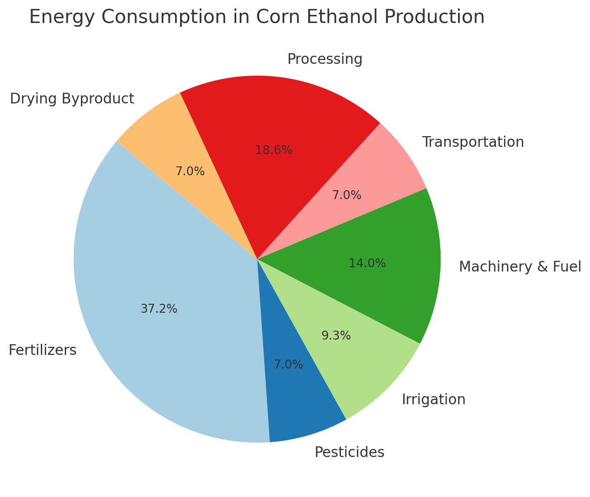
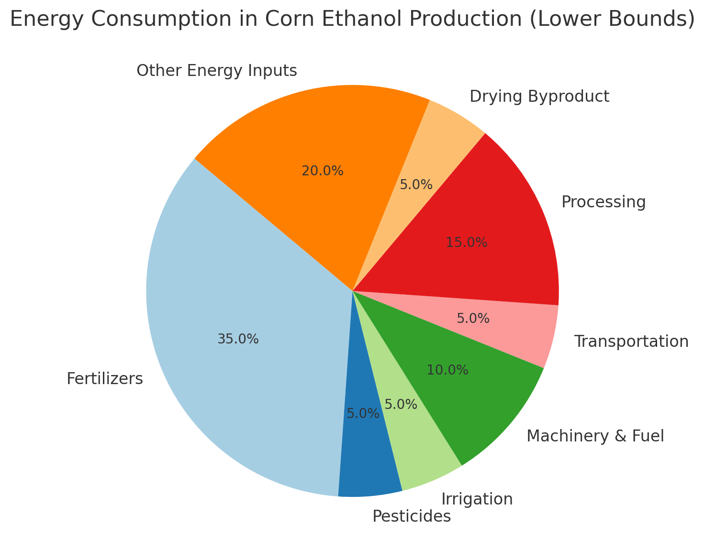

I was watching a video on soybean production in the US and it got me thinking about biofuels.  I wanted to make a quick pie chart and was so impressed by how quickly ChatGPT was able to generate it that I just had to share.

By the way, this post is concerned specifically about the energy implications and not the food security, land use, etc. implications of biofuels.

TL;DR - ChatGPT is amazing but biofuels are probably pretty bad at present, based on my 0th order analysis.

## Negative Net Energy is not Inherently Bad

I had heard in the past that many biofuels, such as corn ethanol, require more energy to produce than they contain.

On the surface, this sounds terrible, but it's not actually so bad when you consider that, depending on the type of energy used to produce corn ethanol, we may be sacrificing some efficiency in return for a more portable, useable form of energy.  Every time you charge a phone battery, for instance, you lose some energy to the inefficiency of wires and battery technology, but in return you don't have to be tethered to the wall.

This is perhaps most pertinent to the argument for hydrogen, where the ``round trip efficiency'' for hydrogen, including green hydrogen (e.g. water -> hydrogen -> electricity) is maybe around 40% (so it takes 2.5x more energy to produce the hydrogen than you will get out when you use it), but hydrogen is orders of magnitude more energy dense than batteries so it may be worth it in some weight-sensitive applications like airplanes, spaceships, and cars.

But to evaluate this, we also have to consider where the energy to produce biofuels is coming from.  If it is largely coming from fossil fuels, which are already portable and which is what they're trying to replace, then it makes no sense - why use 2kg of dinosaur oil to produce 1kg of corn oil?  But if it's coming from solar, wind, or nuclear, then it's a different story.

## ChatGPT to the Rescue

To get a better intuition, I asked ChatGPT to help:
1. First I asked what the typical energy inputs are for various biofuels ([chat transcript link](https://chat.openai.com/share/65f738c1-6f2c-472c-9a1c-784859a46e0c)).  Among other info, it generated some rough numbers in like 2 minutes!
    

      <input id="collapsible-1" class="toggle" type="checkbox"> <!-- delete "checked" to default to unchecked -->
      <label for="collapsible-1" class="lbl-toggle">Corn Ethanol Inputs Breakdown</label>
      

        

    The energy consumption for the production of corn ethanol varies based on the specific technology employed, the scale of operations, and other factors. However, based on typical life-cycle analyses, here's a rough breakdown of the energy consumed in each of the main steps for corn ethanol:

      1. **Agricultural Inputs:** 
         - **Fertilizers:** This is one of the most energy-intensive inputs, especially nitrogen-based fertilizers. Roughly 35-45% of the total energy input can be attributed to fertilizer production and use.
         - **Pesticides:** These might account for 5-10%.
         - **Irrigation:** In regions where irrigation is necessary, this can be significant but might range from 5-15%, depending on the energy source for water pumping.

         Combining these factors, agricultural inputs might represent around 45-70% of the total energy input.

      2. **Machinery and Fuel:** Depending on the efficiency of the machinery and the distances involved, this might account for about 10-20% of the energy input.

      3. **Transportation:** The energy needed to transport corn to ethanol production plants depends on the average distance between farms and refineries. This can vary widely but might represent about 5-10% of the energy input.

      4. **Processing:** 
         - **Milling, Cooking & Liquefaction, Fermentation, and Distillation:** These processes together are significant energy consumers. Distillation, in particular, requires a lot of heat. Collectively, they might account for about 15-25% of the energy input.
         - **Drying the Byproduct (Distillers' Grains):** This step can be energy-intensive, especially if the grains are fully dried for transport over long distances. It can represent about 5-10% of the energy input.

      5. **Other Energy Inputs:** There are also other miscellaneous inputs, like building and maintaining the infrastructure, that might account for the remaining percentage.

      Adding up the percentages, you'll notice that there's a range and some overlap, mainly due to variations in practices, locations, technologies, and the inherent uncertainties in life-cycle assessments.

      It's important to note that while the above gives a rough estimate, real-world data from specific plants and regions would provide a more accurate breakdown. Additionally, as technology and farming practices advance, the energy distribution among these steps can shift. For instance, the adoption of more energy-efficient distillation technologies or the increased use of no-till farming can alter the energy dynamics of ethanol production.
    

    

    

2. Then I asked ChatGPT "with Advanced Data Analysis" ([link to chat transcript](https://chat.openai.com/share/6adf1c6c-62a1-42b9-ab0b-83c4e3ba373e)) to generate a pie chart using the data.  It happily did so, pointing out some inconsistencies in the percentages not adding up to 100% and meaningfully correcting them, in less than a minute!  
     
 (Middles of ranges) 

    
    
 (Lower-bounds of ranges) 

    

## Source of each energy input
We can see that fertilizers, which are mainly produced using the Haber-Bosch process, which in turn uses:
* hydrogen production from methane reforming, which uses methane (obviously) and usually fossil fuels to heat up the methane very hot, although other heat sources are possible just not economically competitive
* lots of heat, probably from fossil fuels if I were to guess, but presumably any heat source could be used
* purification, which idk what that would use  
So basically fertilizers are mainly using fossil fuels.

Aside from irrigation (which can easily be made green), most of the energy inputs involve either generating lots of heat, which presumably is fossil-fuel based currently but could be renewable with economic developments, or requires new equipment (e.g. transportation, tractors, etc.).

## Conclusions
So it seems like most of the energy inputs are fossil fuel based (meaning biofuels are probably not great options at present), but potentially in the future many of these could be made green, especially if renewable industrial heat generation can be made more economically competitive.
