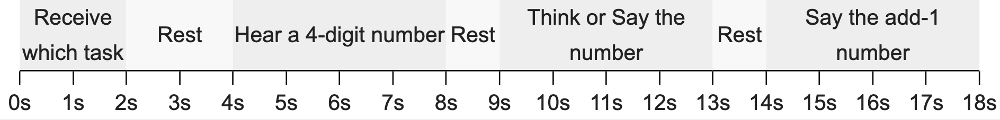

## Intro
Nobel Prize in Economics awardee [Daniel Kahneman](https://en.wikipedia.org/wiki/Daniel_Kahneman) has written several books / papers that mention an "Add-1" mental exercise to study our "System 1" (autonomic) vs "System 2" (deliberate) thinking.  I wanted to try it out for myself, so I made this online demo.  Consider checking out Ch. 2 of his book *Thinking Fast and Slow* for more details.

Here's a video of me trying it out (Add-3 variant):

<!--  -->
<!-- https://youtu.be/a9WvTvfNkvA -->
<!--  -->

    <iframe src="https://www.youtube.com/embed/a9WvTvfNkvA?si=P3WN5on7lGOaigfO" title="YouTube video player" frameborder="0" allow="accelerometer; autoplay; clipboard-write; encrypted-media; gyroscope; picture-in-picture; web-share" allowfullscreen></iframe>

<!-- <iframe width="400" height="375" style="display: block; margin: auto; max-width: 100%; aspect-ratio: 400/375;" src="https://www.youtube.com/embed/a9WvTvfNkvA?si=P3WN5on7lGOaigfO" title="YouTube video player" frameborder="0" allow="accelerometer; autoplay; clipboard-write; encrypted-media; gyroscope; picture-in-picture; web-share" allowfullscreen></iframe> -->

<!-- Intro side-by-side -->

## Instructions
The task is described (among other places), on Page 23 of the book [*Attention and Effort*](https://kahneman.scholar.princeton.edu/sites/g/files/toruqf3831/files/kahneman/files/attention_lo_quality.pdf):
* There's 2 options: listen-think-say, or listen-say-say
* During the entire test, record pupil size and watch as it changes size.  Pupil size is an easily measurable response to mental effort.
* The procedure is as follows:
  1. [2s] Receive the which task (listen-think-say or listen-say-say)
  2. [2s] Rest
  3. [4s] **Listen**: "Hear"[^1] a 4-digit number one digit per second
  4. [1s] Rest
  5. [4s] **Think or Say** the number, except add 1 to each digit, e.g. 1234 -> 2345, or 7932->8043
  6. [1s] Rest
  7. [4s] **Say** the add-1 number (again if you already said it once)

[^1]: Actually instead of "hearing" the number, I just display the number of the computer.  This is indeed quite different and IMO much easier than hearing the number.  Drawing from Richard Feynman's observation that we can often multitask with one task using our "visual" system and the other task using our "auditory" system but can**not** multitask if both tasks are using the same system, then displaying the numbers visually means we can read the number with our visual system, (increment is trivial), and "store" the number with our auditory system all while seeing the numbers for the first time.  If, instead, we followed the experiment and listened to the numbers, then I strongly suspect we would not have the bandwidth to both listen and "store" a different number with our auditory system simultaneously.  This difficulty would arise during both the "memorization" and "give-the-answer" phases so the task would be significantly more difficult.  Perhaps if I have time later I can implement a "listen" option.

Visual depiction of the procedure[^1]:
[{: style="width: 100%; margin: 0;" class="alt-timeline" }](images/add1_timeline_screenshot.png)

  

    
Receive which task

    
Rest

    
Hear a 4-digit number

    
Rest

    
Think or Say the number

    
Rest

    
Say the add-1 number

    
0s

1s

2s

3s

4s

5s

6s

7s

8s

9s

    
10s

11s

12s

13s

14s

15s

16s

17s

18s

    

  

<!-- 

[Demo Runs Here]

 -->

## Demo

  <input id="collapsible" class="toggle" type="checkbox"> <!-- delete "checked" to default to unchecked -->
  <label for="collapsible" class="lbl-toggle">Help?</label>
  

    

#### Demo Options
* Recording: You may enable webcam recording so that you can go back and watch (and download) a video of your pupils.  You may want to get really close to the screen and shine a flashlight at your eyes if you have dark colored eyes.
* Task selection: Although the results ([pg 23](https://kahneman.scholar.princeton.edu/sites/g/files/toruqf3831/files/kahneman/files/attention_lo_quality.pdf)) were stated that it didn't make much difference whether the middle item was to "think" or "say" compared to the overall task difficulty, I still give the option to let the computer randomly select which one you should do, as in the experiment.
    This only changes the text displayed but not the behavior.  
* Variant Selection: You can try 3 variants:
  1. Repeat the same number
  2. Add-1: Add 1 to each digit (e.g. 1234 -> 2345 or 7932 -> 8043)
  3. Add-3: Add 3 to each digit (e.g. 1234 -> 4567 or 7932 -> 0265)

  This only changes the text displayed but not the behavior.

  

  

    <input type="checkbox" id="enableRecording" name="recordingOption">
    <label for="enableRecording">Enable pupil recording?</label>
    

  

  

    Which Task: 
    <input type="radio" id="listen-think-say" name="task-type" value="listen-think-say">
    <label for="listen-think-say">Listen-Think-Say</label>
     
    <input type="radio" id="listen-say-say" name="task-type" value="listen-say-say">
    <label for="listen-say-say">Listen-Say-Say</label>
     
    <input type="radio" id="random" name="task-type" value="random" checked>
    <label for="random">Random</label>
  

  
 2345 or 7932 -> 8043)
  3. Add-3: Add 3 to each digit (e.g. 1234 -> 4567 or 7932 -> 0265)
  This only changes the text displayed but not the behavior.">
    Which Variant: 
    <input type="radio" id="task1" name="task-variant" value="0">
    <label for="task1">Repeat the number</label>
     
    <input type="radio" id="task2" name="task-variant" value="1" checked>
    <label for="task2">Add-1</label>
     
    <input type="radio" id="task3" name="task-variant" value="3">
    <label for="task3">Add-3</label>
  

  

    <label for="numRuns">Number of Runs:</label>
    <input type="number" id="numRuns" name="numRuns" min="1" max="10" value="1">
  

<!-- 

  <button onclick="startRecording()">Start Recording</button>
  <button onclick="stopRecording()" disabled>Stop Recording</button>
  

    
  <video id="videoElement" style="display: none;" controls></video>

 -->

  <button onclick="startDemo()" id="start">Start!</button>
  
[Demo Runs Here]

<video id="videoElement" style="display: none;" controls></video>
<button id="downloadButton" style="display: none; margin-top: 5px;">Download Video</button>

<!-- Demo js code -->

<!-- Recording stuff -->

<!-- Divider bar for footnotes -->
---
### Footnotes
