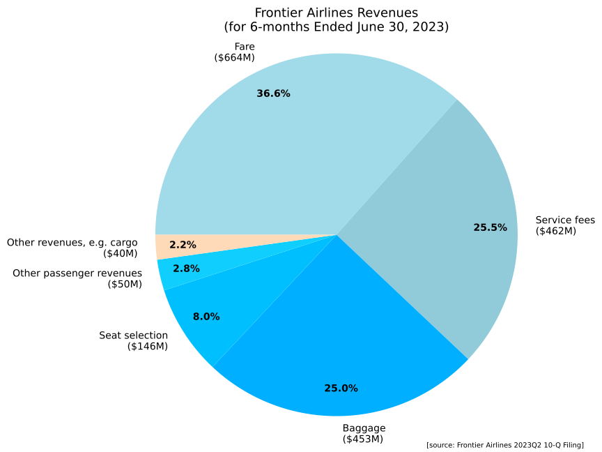
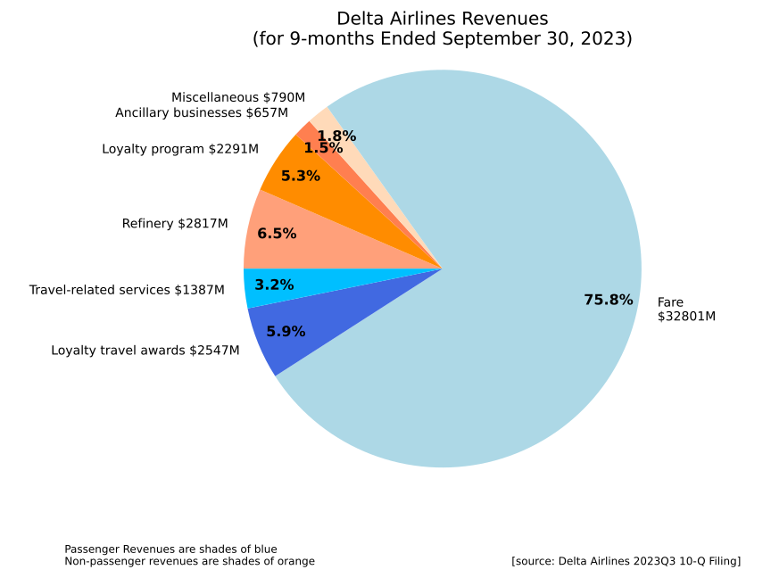

## Introduction

We all know the budget airlines (e.g. Frontier, Spirit) love to charge exhorbitant fees for everything from carry-on bags to seat selection. But how much of their overall revenue comes from these fees? And how does that compare to the legacy airlines (e.g. American, Delta, United)? In this post, we'll take a look at the breakdown of airline revenues to see how much they make of fares vs fees.

## Data Sources
Data is readily available in SEC 10-Q Filings (quarterly reports) under the category "Revenue Recognition".
For example,
* [Frontier Airlines 2023Q2, pg. 10](https://ir.flyfrontier.com/static-files/7fdeb254-16c5-44a4-bde9-392fd3558803)
* [Delta Airlines 2023Q3, "Notes to Financial Statement" > "Revenue Recognition"](https://d18rn0p25nwr6d.cloudfront.net/CIK-0000027904/453e0eb5-f032-419a-9eab-ade5628da579.html#)

I only did this for 2 airlines, but it's easy to obtain these for any airline.

## Results (Pie Charts)
[{: style="width: 50%; float: left; margin: 0;" }](images/FrontierAirlinesRevenues.svg)
[{: style="width: 50%; float: right; margin: 0;" }](images/DeltaAirlinesRevenues.svg)

Note that, for Frontier, "Service Fees" is often listed as something like "Carrier Interface Charge *Non-Refundable" on your ticket receipt, next to things like TSA fees and taxes, so it's basically just the the same as "Fare" from a consumer point of view, bringing the combined **"ticket price" percentage up to around 62%**.

I would have liked to create a stacked bar chart with all the airlines, but I think it might be tricky to come up with a standardized set of categories to use, given how different Delta and Frontier are here.

## Discussion
Immediately obvious is that a significant portion of Frontier's revenue comes from "scamming" people out of baggage and seat selection prices.  Or, alternatively, people who pay for bags and seats are subsidizing the fares of those who don't, which is in some senses more "fair" - if I fly without baggage then shouldn't I get to pay a lower fare?

Meanwhile, Delta's revenue from Fares is a slightly larger proportion at 76% (compared to 62% for Frontier's Ticket Revenues).  Also, rather than making money from baggage and seat selection (3.2% combined vs 33% for Frontier), Delta makes significant money from Loyalty programs and other random stuff (like maintenance services to other airlines and jet fuel refining).
