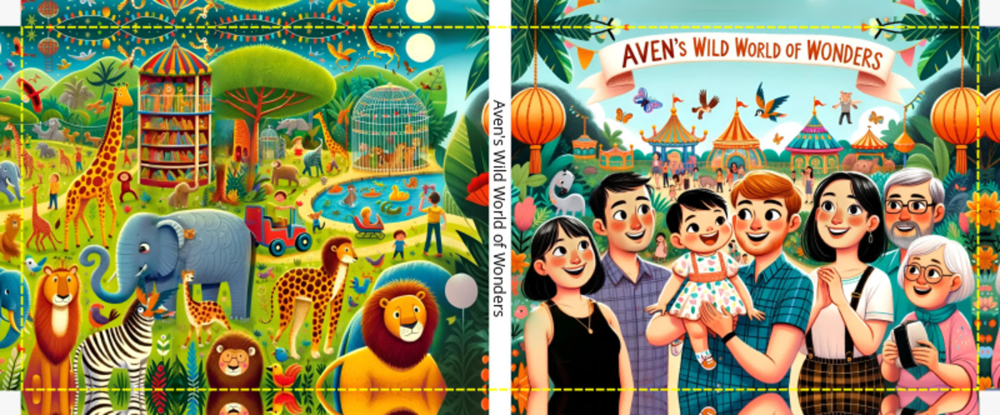
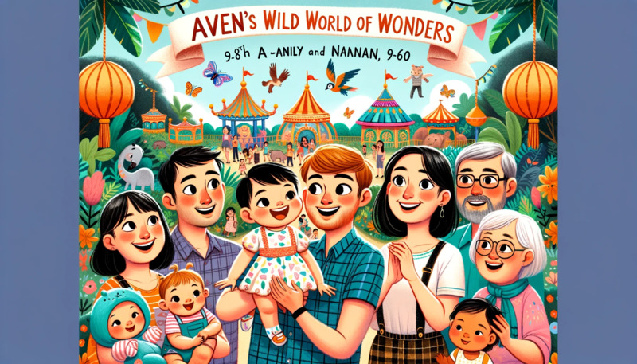
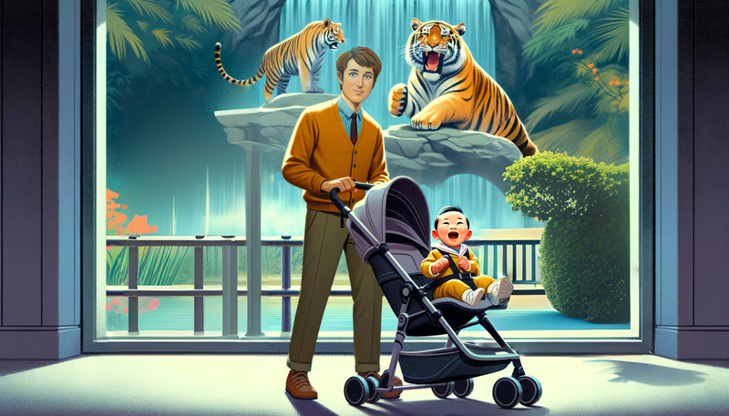
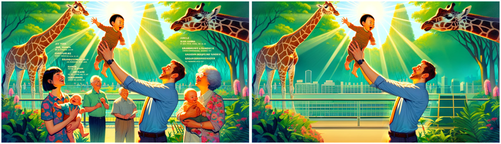
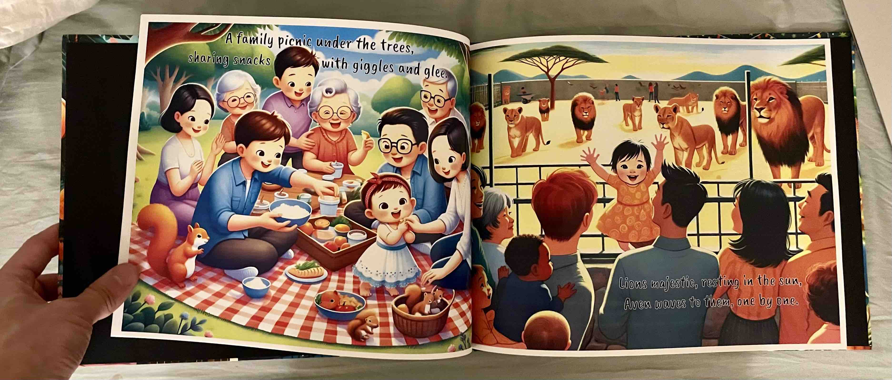


- [Introduction](#introduction)
- [Process / Procedure](#process--procedure)
  - [Step 1: Generate a story using ChatGPT-4](#step-1-generate-a-story-using-chatgpt-4)
  - [Step 2: Generate illustrations using DALL-E 3](#step-2-generate-illustrations-using-dall-e-3)
    - [Prompts](#prompts)
  - [Step 3: Editing using AI](#step-3-editing-using-ai)
    - [Generative fill tools](#generative-fill-tools)
    - [Upscaling / Super-resolution](#upscaling--super-resolution)
    - [Generative edge fill](#generative-edge-fill)
    - [Adding text (not using AI)](#adding-text-not-using-ai)
- [Concluding Thoughts / Reflections](#concluding-thoughts--reflections)



# Introduction
This Christmas, I wanted to create an illustrated children's book for a <1 year-old using generative AI tools for 2 primary reasons:
1. I was eager to try out the new generative AI tools to get a better feel for their capabilities, strengths, weaknesses, etc. and
2. I thought it would be fun and cute.

You can view a low-res preview of the final book [here](book_compressed.pdf), or full-res (but not cropped-to-book-trim) images [here](https://photos.app.goo.gl/HNckeK5UG4iWo9457)!

<!-- embed pdf -->
<!-- <embed src="book_compressed.pdf" width="500" height="375" type='application/pdf' > -->

# Process / Procedure
My plan was to use the following pipeline:
1. Generate a story using ChatGPT-4, defining both the text and a description of the illustration on each page.
2. Generate illustrations using DALL-E 3, using the descriptions from step 1.
3. Make any necessary edits to the illustrations using generative fill tools.

## Step 1: Generate a story using ChatGPT-4
Generating the story was the easiest part!  ChatGPT excels at this type of task.

You can view the [transcript here](chatGPT_transcript.html).

<!-- <embed type="text/html" src="chatGPT_transcript.html"  width="500" height="200"> -->

## Step 2: Generate illustrations using DALL-E 3
This step was rather difficult - particularly trying to get images with all the right characters doing the right things.  Trying to get one or two characters right was feasible, but to get e.g. 7 characters all with the right gender, age, and race (e.g. for the cover) was next to impossible.  Ultimately, just created a handful of variations until I got one reasonably close, then used generative fill tools to make the necessary edits removing the extra characters.

The artistic style and character appearances were also not consistent across pages, but I didn't bother trying to fix this.  Nevertheless, this is certainly an identifiable weakness of DALL-E 3.  As I understand, inter-image consistency is an area of active research, so I expect this will improve in the future to some degree.

Although I gave a decent amount of effort towards the cover and the first couple pages (first impressions matter!) I hardly did any variations/retries/edits on the later pages.

Also note that DALL-E 3 can natively generate 1792x1024 images, but I compress them in this article to save on website hosting costs.


### Prompts
To generate the images, I gave a prompt first listing textual descriptions of all the characters, then pasting the story text from step 1, and finally asking for particular images.  For example,

> Can you generate an 11x8 illustration for each page of this children's story?
> 
> Aven is a very happy, lively 9-month old asian-caucasian baby with parents Alice (Asian, 34F) and Bob (tall caucasian with reddish-brownish hair and a small amount of facial hair, 34M).  Carol is ...
> 
> **Page 1**
> - **Text:** "Aven's day at the zoo, so much to explore, with family around, who could ask for more?"
> - **Scene:** Aven in her stroller at the zoo entrance, surrounded by her family, all excited and ready for adventure.
> 
> **Page 2**  
>   ...
> 
> First, before generating the images, please list every member of the family with race, age, and a rough appearance description for Jim.
> 
> Start by creating an 11x8 children's-book style illustration for pages 1-4.
> 
> \* ... DALL-E generates images ... *
> 
> Good, now continue with pages 5-8

The cover didn't need to be specific about the plotline:
> Aven is a very happy, lively 9-month old asian-caucasian baby with parents ...
> 
> Can you generate 4 variations of a 2:1 illustration for the cover of Aven's children's story book entitled "Aven's Wild World of Wonders"?  It's about her visiting the zoo.

This would give a result like this:

from which I then "photoshop-ed" out the extra baby characters at the bottom in Step 3.


## Step 3: Editing using AI

There were 3 primary editing operations I did:
1. Generative fill to add/remove/change foreground characters
2. Upscaling / Super-resolution
3. Generative edge fill / expand
4. Add text (not using AI)


### Generative fill tools
I tried a handful of AI generative fill tools with wildly varying qualities, but they were all extremely underwhelming.

I suspect one major reason for the poor results is that I was trying to use these tools on illustrations whereas I think they were probably intended/trained to be used on photorealistic images.  Here is a nightmare-inducing example where I tried to generative-fill a character's face, which turned out disproportionately sized, inconsistently lit, and stylistically way off:

Nevertheless, removing characters (and replacing them with background) worked "ok", even though there were some architectural incongruity artifacts, it was more-or-less passable.  For example:

I tried using:
* Photopea "Magic Replace" - replace a selection of an image by "remove"-ing foreground or replacing with a textual description.
  * This worked pretty poorly, but was ok for removing characters and was leagues better than Picsart
  * Photopea is, in general, a pretty nice tool that I had heard of before as a Photoshop alternative/knockoff.
* Picsart "AI Replace"
  * this is completely unuseable.  Results were atrocious and nightmare-inducing.

I didn't get to try out Photoshop's generative fill because apparently Georgia Tech doesn't give us students licenses :(

I also didn't try out other "magic eraser" (e.g. Google Pixel) because I assumed those would be heavily optimized for photorealistic images and not illustrations.



### Upscaling / Super-resolution
This was easy and worked well.  Using picsart "batch" processing, I did "AI enhance", then dumb "resize" to 4096 wide, then "AI enhance" again.  There's probably a better way but this worked pretty well and was easy.



### Generative edge fill
Some images were framed un-centered, and the cover images needed to be extended so that they could be folded over the hard cover to be glued.

Although I tried using picsart for the generative expand / edge fill to do these, it didn't really work well, so I ended up just doing non-AI edits.  The un-centered images I just lived  with or cropped, and the cover I just mirrored the edges manually using Mac Preview (generic basic image viewer/editor).  The cover mirroring you can see in the photo at the top of this page.



### Adding text (not using AI)
I used Photopea to add text, but in retrospect this would have been way easier in MS Powerpoint because I'm so much more familiar with Powerpoint.  The text is really difficult to read in many places because I was too lazy to figure out how to get text color backgrounds but it would have been trivial with powerpoint (just be sure to set page setup to the same resolution as the images).  Cropping & edge mirroring would have also been easier with powerpoint.  Oh well.  Live and learn.


# Concluding Thoughts / Reflections
In total, making the book took about 7 hours:
* ~2min to generate the story
* 30min to generate the some initial images
* 1.5hr trying to tune prompts to get better images
* 3hrs trying to photoshop-out characters
* 2hrs using super-resolution, extending the cover since you lose a bit on the edges when it gets folded, adding text over the images, placing the order into walmart.com, etc

I feel like 2 issues were really clear:

1. **Consistency between pages**  
    Although it’s kind of neat for each page to have a different style, I think it’s usually undesirable to have each page look like it’s by a different artist.  Also the character consistency between pages - the characters look different on each page.  I think these are active areas of development.
2. **Getting the right characters on each page**  
    If you try to specify one or two people it can do it, but trying to get like 7 people with the right descriptions on a page is impossible.  It would always throw in random extra people or missing people or wrong descriptions or something.  I combined it with generative fill to photoshop-out people which took the most time.  Also, probably a function of the softwares I was using but generative fill sucks compared to the initial generation.  Impossible to put people in and still look good, but could take people out with reasonable quality.

Personally, I don't think the book is winning any awards, but I do think this was a really fun/funny project.  I like to laugh at the oddities, like one of the early pages I generative-filled  Bob’s face so it ended up looking “photorealistic” instead of illustration; all the random Asian people; the one page where Aven’s suddenly like 4years old then back to 1yr old on he next page; etc.

I placed the order as a same-day hardcover on walmart photos, but it didn't turn out well (the hard cover didn't seem professionally folded).  Last year I used shutterfly for a photobook which was great quality and half the price, so in the future I think I'll use a similar online service - just keep in mind online will take ~2 weeks to arrive.

  <!-- <object data="https://lh3.googleusercontent.com/pw/ABLVV85-Vjuw8WgTXDgY4GkwwzFE-daoZ8mgMQNmXQV_LI6CIShMrosSjWb8-YHikGLQbvDI6dMwBALvhawWJW79_dLIZOBbs65ZiPK7M7KGjbdMr0zx9DZL=w1920-h1080"></object> -->
  <object data="https://lh3.googleusercontent.com/pw/ABLVV855vKvQWBTtF6EOhK9blGzINS7KCmDJwMSBYYmksf1pXnik3NRS0B8SrNHdkdFR3ohNFtgAJnHBWg5CVTLn9iYm7pxa0m2SgnmmYESs78_u1UBx55eM=w1920-h1080"></object>
  <!-- <object data="https://lh3.googleusercontent.com/pw/ABLVV87aunMiTVDEq7izQLuGSFWRoypbNBLaMRth2pMBjUPicjpP7wTkJaXPg6OWOvtvypGzghUuc63t_gjQc-V-4p-MGjAMY85YzSnW0dGre-iGjddwXE8B=w1920-h1080"></object> -->
  <object data="https://lh3.googleusercontent.com/pw/ABLVV86gsTtZMAX2dkbOJeIdkxul8IB8jqHaU0dSA7ihfrooSVIf6N4lYWQOhv2cSqTfRoQiWuOX7mYSd6POa0WqDwM0opIq87EtxXL5r9CeAqDZkvDnektw=w1920-h1080"></object>
  <object data="https://lh3.googleusercontent.com/pw/ABLVV86c5-1b1_LnbsgsLH-rBb5tS-qIWY7HBIfe3SDBgjqDXbTEponYX7xavquecs0jHVLZkUeFJbnaMoGai2NTj5-ql_ytH2Vob0S75zvK-uILjvZZfsEI=w1920-h1080"></object>
  <object data="https://lh3.googleusercontent.com/pw/ABLVV85nksS3N4qguHihAwrey4r60BoyJH4YPSlXNqAP1Ritqu1i_Ik0W0LnwPxbb4V8Ug8cA6PKSDx5P7lj9MsDHFXi1RoJYE5S40J-fZcFuzTVbZ0vh1jH=w1920-h1080"></object>
  <object data="https://lh3.googleusercontent.com/pw/ABLVV86LRZGqlnqXHxxRLX8CM2TWLYKBtt0uA-tIOZXvkDZhaqx3PXTE73eNdcc9dro6o3PZY-QfpG6CM3Lj8SgvzMws6orMg3JFbmOaDMCrcFsbDRLrRL9B=w1920-h1080"></object>
  <object data="https://lh3.googleusercontent.com/pw/ABLVV870rG_9pDbJSJ-8GbFQH31Ek6JnkDp1VVYuxlW79cs97bFZINSinjzk0517vrck9s1DLiiesyjh0fZNVFJk6wbxpZDX6I0yp9oHCBktkWowMIqfowvx=w1920-h1080"></object>
  <object data="https://lh3.googleusercontent.com/pw/ABLVV86-7jxvvcy7GqrBf9ETZZwcmT0RPSmheByrLXOcoJg-iKkAEoH67_oIbMjr3nIx9H-c5Xx6oxCd4GfAeQBXlqUusgAbmuWu4rJQ13vyprWgkQtRDwUR=w1920-h1080"></object>
  <object data="https://lh3.googleusercontent.com/pw/ABLVV86KVEAt9lvI0BZ5AHEKtFpuVLYaT8yMZt0YFjXeXzt0P9VjpQEoDkBm4mOI9B6Ifwy7nSTI4hWM4ayF2WDbGI2RQUFGg5XppC5Gccy3gR9lGFXQW9AY=w1920-h1080"></object>
  <object data="https://lh3.googleusercontent.com/pw/ABLVV84AYafVWpWhnBk0mZFwZM2gQHWaiUVQbt9CIWVURhxnh4ir99GnIvAqSq6Dnyky21dahnSD35szCbsVYJgm1Xs9TN7Lwc1Ur_mqh6PxCQIpKJq2ko6K=w1920-h1080"></object>
  <object data="https://lh3.googleusercontent.com/pw/ABLVV8635de55hwcGRIio7ZmmAk9OJiB3FAQOrsIre9lFQVUMX1fkiumG6Rs_k15927fqHZW5AZH5l6PwN2Wih6J99Np4kmDi3jrGP5u-8wHMKISfHcMYSBu=w1920-h1080"></object>
  <object data="https://lh3.googleusercontent.com/pw/ABLVV87ANXISBmhxA0g149B8JubDqc3F3gUiVRsTBpmFINdLdONFRHvQENwPODsBvwbpYOrCyoS3WoOufULFbFWUOtfZEtHRy8Fzfx002R2ySc2pOrA494HT=w1920-h1080"></object>
  <object data="https://lh3.googleusercontent.com/pw/ABLVV87lCiXyA14ice68nnEPA685EACQlgH2QOHDFFfGJz90qZn0SnXt_pbY4T7jh5673N4S8LAn9bmivC61U3cPIgcSsKw2zXPGPN4-E9nUSWlNtG3RIGEL=w1920-h1080"></object>
  <object data="https://lh3.googleusercontent.com/pw/ABLVV85jFk9aOlRWU981MRACSIKrjhMMh-xwiDcVX0mfrke_tVHweiFwhvSZh7CKbcNrpevnrCDLrVK3R9NQXj6ImCfscYJn6gvBtP8pVOPPWoayKQPuYmtg=w1920-h1080"></object>
  <object data="https://lh3.googleusercontent.com/pw/ABLVV85QrFfQ_Pz6uiK6m2Sfzg3TWDg2w8HQm-Xkq0H3k1Ifi0RbfRMLwB9wDWmo0k_aYNUnsbRj_FrGzYqbuM45AteqBDTSeD0M7vTBukDMOAUhiQo_dQmV=w1920-h1080"></object>
  <object data="https://lh3.googleusercontent.com/pw/ABLVV85q-A6liPti1wfSj-kRz7YVtUepvYqVa_QV1wMHqK20Oi5BLMzwdhn_bhvz-_AILgFGijD34WtdSccOVMpifkD8n5qffnoSplKaDfP1OiTzAz-rPh1l=w1920-h1080"></object>
  <object data="https://lh3.googleusercontent.com/pw/ABLVV846H8tgqKgBBjdfoiA3syHToS6t_ku3RO1vIAW-o8AerT2VlCW2BxBKeImyPXa8K5sEJH5q94JZ57IZrrxqBwSfJTDvqKmYB_Ypa4jZZKp7osWhb5Jy=w1920-h1080"></object>
  <object data="https://lh3.googleusercontent.com/pw/ABLVV86dbB_WumwSxIgKQcJiX35-zvIlhnOYr_iHgLqnvN17LS3B_DgfQvFauxLOIhD0ifSrPbpHV36VHP-2XRuQdmXk8mRqdfHOWNmZHgEOE3BRJbGOxtX9=w1920-h1080"></object>
  <object data="https://lh3.googleusercontent.com/pw/ABLVV84leyajMP1NFNYVqbJRIhyRIL9C_3OWQDnGx0IYTpTb6tAAQCbnuRwjos0YIHWIiN-bOcqvhY2d1X3_GhIVAV-miozrE73-ylYnSWy4wNLCv9M0Jp0G=w1920-h1080"></object>
  <object data="https://lh3.googleusercontent.com/pw/ABLVV87Ovh32wStE4g-_en8eyzBWBWYy3ua3QJnau3e2yu87lOLJv36mp41C3sxoIcmavRZ9JfhQGsmxGi7DwXocZGv72koytvjh_0BcvWvL-048Ceaq74ow=w1920-h1080"></object>
  <object data="https://lh3.googleusercontent.com/pw/ABLVV84s3JhbtAqaK_u9c2_09ol78R2gnfpA8Y9V_B4yDWgv2s_DXGHBhzJ7DFGNcTx7YC3YH_G-HwfxA2x1kh-7bNJh6-gwsGxeavsq3ZCnX1eD1mGAMhpY=w1920-h1080"></object>
  <object data="https://lh3.googleusercontent.com/pw/ABLVV84qQNz1eJz_dv8qwq-SgG-1Elq7G3GRxKV5M2K3kImi9cqe3cluvqn9ff7c_dYwqaei4BEQa7bRqKP_zjR2yOf2YcGV6tTe1xg6Gt1ATjIr7AvfI70Y=w1920-h1080"></object>

