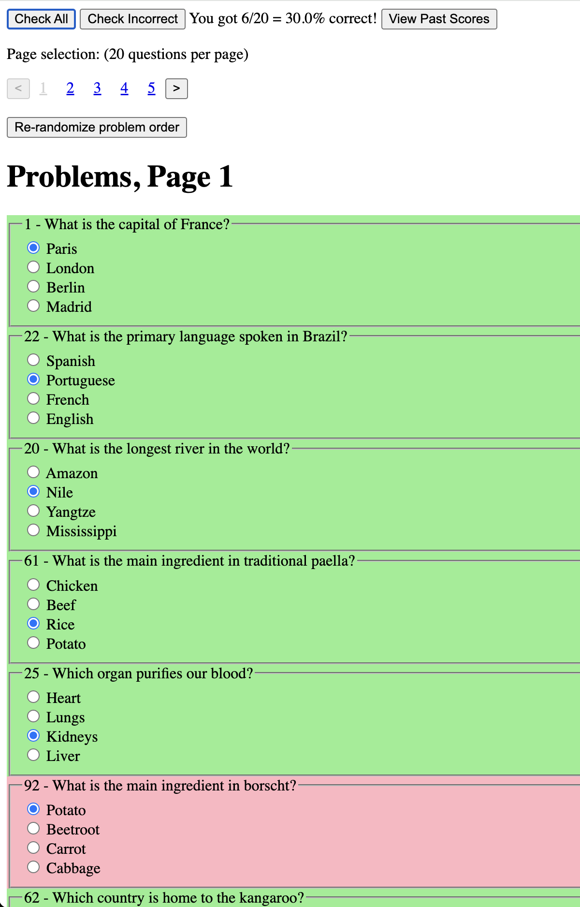
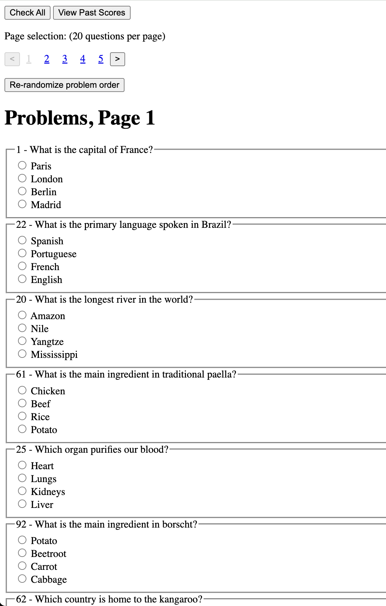
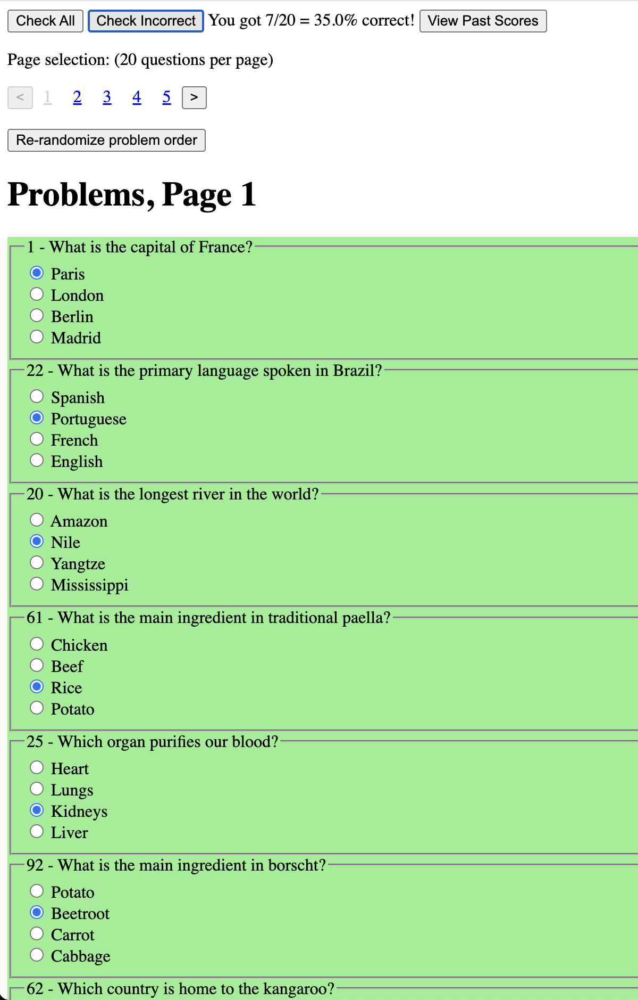

<!-- html5 video of scoresPage.mp4 -->
<video controls muted autoplay style="display: inline-block; width: calc((100% - 60px) * 0.67084626); margin-bottom: 15px;">
  <source src="scoresPage.mp4" type="video/mp4">
  Your browser does not support the video tag.
</video>

View the quiz at [https://gchenfc.github.io/AMF-practice-problems/sample/All_Problems.html](https://gchenfc.github.io/AMF-practice-problems/sample/All_Problems.html)

# Introduction
My girlfriend is studying for her AMF exam (a financial certification exam in France) and was frustrated by the UI of the test prep website.  It's slow, clunky, and doesn't let you try the questions multiple times (remembers previous answers and doesn't let you re-check new answers).  So I decided to scrape the questions and create a simple quiz site for her to practice.

I also wanted to use this as an opportunity to try out cookie-style "localStorage".  I had used "localStorage" type things for Chrome extensions, and wanted to see how it would work for a simple SPA.  I learned it's ridiculously easy to use, and will definitely be using it in the future if relevant.

# Design Requirements
* All the quiz questions from each sub-section easily accessible in one place (some questions were presented at the end of each section, but she wants them all in one place)
* Randomize the order of the questions
* Present questions in sets of 20, so that she can do a few at a time instead of all 290
* Allow her to try the questions multiple times (e.g. if incorrect, try again until correct)
* Remember the order of the randomized questions so she can take a break and come back, but allow manual re-randomization so she can re-quiz herself multiple times.
* Keep a record of her scores and which questions she got wrong how many times so she knows which questions to focus on.

# Implementation
## Scraping
I poked around the site's html and "network" tab to see how the questions were loaded and decided it would be easiest to just manually save an html file for each quiz section.  Selenium was having trouble fetching the site assets automatically due to cloudflare, and there were only 10 chapters or so, so I just spent 10min manually saving each section's html using cmd-s.

Then, I used BeautifulSoup to parse the html and extract the questions and answers.  I saved the questions in an html file and the answers in a json file for easy loading in the quiz app.

## Quiz App
I created various versions (e.g. by chapter, by section, all together randomized) for her.  To avoid infringing on AMF's copyrights, I will only share the randomized site with dummy questions (generated by ChatGPT) instead of the original questions.  The full quiz with real practice problems is at a private url, so she can easily access it by url on any device but it isn't indexed by search engines or otherwise tractably find-able.

[Quiz Site!](https://gchenfc.github.io/AMF-practice-problems/sample/All_Problems.html)

The quiz consists of 2 single page applications (SPA):
1. The problems, w/ a button to check answers
2. The past scores

The problems has a hidden html div with all the problems, and a javascript file presents only 20 problems at a time (by cloning the problem divs).  The javascript creates a random order for problems (and saves the persists the same random order across sessions using localStorage) and presents 20 at a time.  A button is available to manually re-shuffle the problems.  Another javascript file does all the correctness checking, and allows checking all the questions, or only the incorrect ones (after one round of checking, you can go back and correct the ones you missed and re-check only those).  It also saves the check results in localStorage.

The past scores page has a "table" of all the past scores, with the ability to click on a row to see the question and answers for that problem.  It also has a button to reset the scores.

# Results

  

    
Before Grading

    
  

  

    
After 1st Grading

    
  

  

    
After Correcting and Re-grading

    
  

