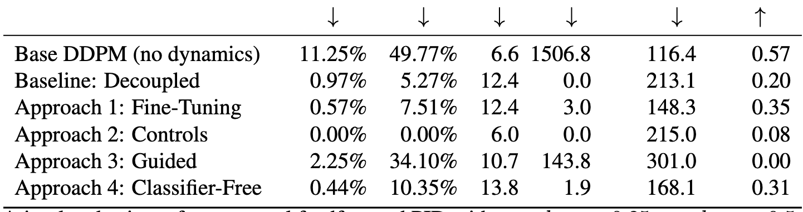
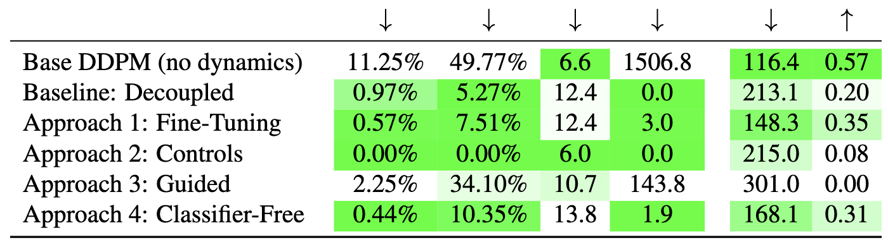

How many times have you seen a table in a scientific paper that has so many numbers it's impossible to tell at a glance which method is best?

I usually write python code to add colorizing commands but this time I decided to use ChatGPT to write some javascript code hosted on my website so that I don't have to re-write the python code every time.

Compare for example the following before/after:

<table>
<tr>
  <td>
    <h3>Before</h3>
    
  </td>
  <td>
    <h3>After</h3>
    
  </td>
</tr>
</table>
 

Access the tool [here](colorizer.html) or by scrolling down.

---

<embed type="text/html" src="colorizer.html" width="100%" height="1200">
