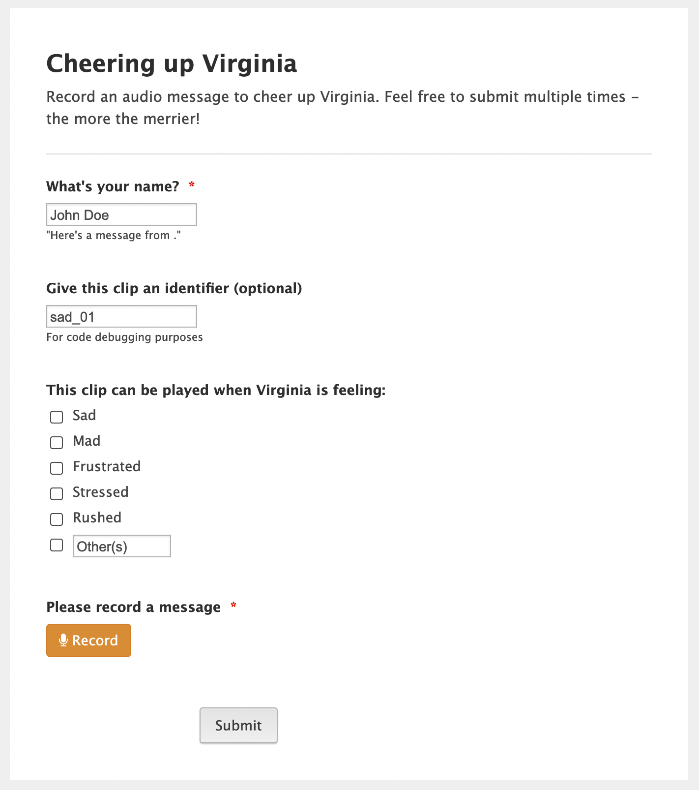

{: style="margin-left: 0;"}

I wanted to learn about creating Alexa skills, so I created this Alexa skill for Virginia Pan to play pre-recorded audio messages from loved ones to cheer her up.

  <input id="collapsible2" class="toggle" type="checkbox"> <!-- delete "checked" to default to unchecked -->
  <label for="collapsible2" class="lbl-toggle">Example Usage</label>
  

    

The usage would be something like:
> Virginia: "Alexa, comfort me."  
> Alexa: "How are you feeling?"  
> Virginia: "I'm sad"  
> Alexa: "Sorry to hear that Virginia.  Maybe this message from {} will cheer you up."  
> Alexa: *\*plays recording\**  
> Alexa: "How are you feeling now?"  
> Virginia: *\*some gibberish\**  
> Alexa: "Sorry, I don't know how to deal with that.  Is there another emotion you're feeling?"  
> Virginia: *\*no response\**  
> Alexa: "You can say things like, I'm sad, or, I'm angry.  How are you feeling?"  
> Virginia: "I'm frustrated"  
> Alexa: "Sorry to hear that Virginia.  Maybe this message from {} will cheer you up."  
> Alexa: *\*plays recording\**  
> Alexa: "How are you feeling now?"  
> Virginia: "I'm better"  
> Alexa: "Goodbye!"
> *session ends*

or, the faster version,
> Virginia: "Alexa, open comfort me, I'm angry!"  
> Alexa: "Sorry to hear that Virginia.  Maybe this message from {} will cheer you up."
> Alexa: *\*plays recording\**  
> Virginia: "Alexa, stop"
> *session ends*

  

  <input id="collapsible" class="toggle" type="checkbox" checked> <!-- delete "checked" to default to unchecked -->
  <label for="collapsible" class="lbl-toggle">Table of Contents</label>
  

    

- [Recording Audio Messages](#recording-audio-messages)
- [Downloading Audio Messages](#downloading-audio-messages)
- [Alexa Skill](#alexa-skill)

  

## Recording Audio Messages
First, I created a jotform and sent the link to her friends+family to collect audio messages.  

## Downloading Audio Messages
The process of moving the audio recordings from jotform to AWS/Alexa was a pain, since the audio files are private access, i.e. they can only be downloaded by the owner of the form (me).  In the end, I found the easiest way to get the audio files to Alexa was to write a python script to scrape/download all the files from jotform (using my login cookies) then upload to the appropriate AWS S3 bucket.

## Alexa Skill
Coding the Alexa skill was way more annoying than I initially expected.  I guess this is because it's difficult to create/expose a nice API for the voice recognition that is sufficiently sandboxed to your own skill while also allowing for the wide set of applications developers may want to implement.

The code is available on [{: style="display: inline; margin:0"}](https://github.com/gchenfc/CheerMeUp), but the real audio recordings and other sensitive information is removed for privacy.
