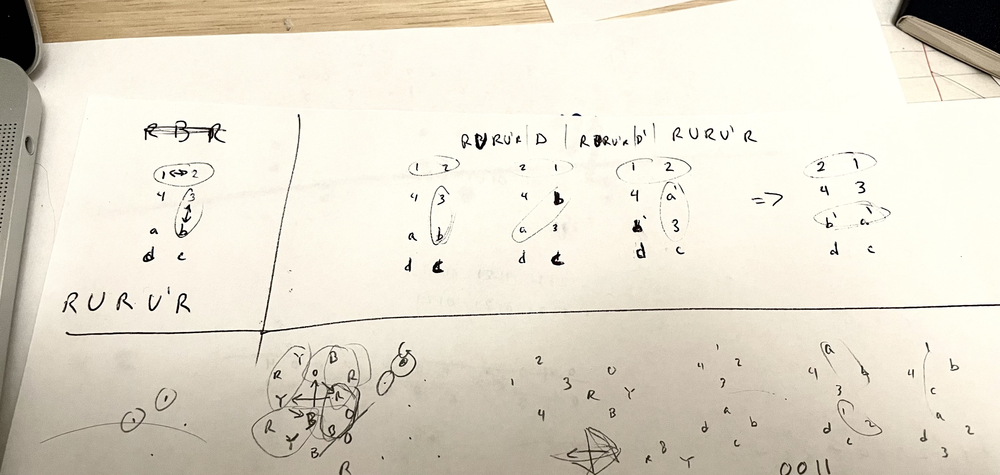


- [Preface](#preface)
- [Preliminaries](#preliminaries)
- [Notation](#notation)
- [The Strategy](#the-high-level-strategy)
  - [Step 1: Solve one half of one face](#step-1:-solve-one-half-of-one-face)
  - [Step 2: Cubify the Puzzle](#step-2:-cubify-the-puzzle)
    - [Python Cubify Assister](permutation_solver)
  - [Step 3: Permute Edges](#step-3:-permute-edges)
  - [Step 4: Permute Corners](#step-4:-permute-corners)
  - [Step 5: Fix Parity](#step-5:-fix-parity)
- [Conclusion](#conclusion)



Something like 10 years ago, my mom got me one of these Square-1 Rubik's cube style puzzles.  At that time, I was already pretty proficient at the standard 3x3 (and some simple variants like 2x2, 4x4, 5x5, pyramid, void) Rubik's cube, but after just a couple minutes, I soon realized that I was in way over my head and I completely gave up for many years.  
<br />
Last Christmas, I just randomly picked it up again for a few minutes and realized that actually it wasn't as bad as I thought all those years ago; seems my logical thinking skills have improved.  I gave it a go for 30 minutes or so and made some progress but was still a little ways off from solving it.  
<br />
Yesterday, visiting home, I picked it up again and, suddenly started feeling inspired, decided to try to solve it for real this time.  4-ish hours later, I finally solved it without looking up any algorithms :)  
<br />
This is a writeup of my journey and technique for solving the Square-1 puzzle from scratch, with no prior knowledge of the puzzle.
<div style="clear:both;" />
{: style="width: 40%; float: left;" }
{: style="width: 40%; float: right;" }




Although initially intimidating, the Square One is actually just composed of 2-faces each with 4-skinny ("edges") and 4-fat ("corners") slices.  This is because
1. Independence: the middle row pieces are not congruent with any of the top/bottom face pieces,
2. Middle Row Permutation: there are only 2 pieces in the middle row so we don't have to worry about the permutation of the middle row, and
3. Middle Row Orientation: the orientation of the pieces is easy to flip-flop if we need to at the end with `/(6,0)/(6,0)/` (see notation section below).

Therefore, we can ignore the middle row and just worry about solving the top and bottom faces.  Note that pieces can be moved between the 2 faces (they are not independent of each other).

Then the possible non-redundant moves can be enumerated as:
* rotate the top face
* rotate the bottom face
* rotate the right-half by 180° (not always possible)

Finally, I will mention that I required some computer assistance (which I coded) for one part which you'll see when it comes up.  I guess if you're trying to learn to solve the Square-1 for real, it's best to refer to another guide for the most efficient algorithms anyway :)





When I initially started working this out myself, I used some custom notations, but in the interest of making this more accessible to others, I learned the standard notations just for you ;).   I tried to change everything to standard notation, but let me know if I missed anywhere.  Here's the standard Square-1 notation:

* **(2, -1)** means turn the top layer 2-increments (60°) clockwise and the bottom layer 1-increment (30°) counterclockwise
* **/** (slash) means turn the right-half of the cube 180° ("slice" move)

So, for example, try the middle-row-orientation swap:

```/(6,0)/(6,0)/ ```

which means slice, turn the top face 180°, slice, turn the top face 180°, slice.

After executing, the cube should look exactly the same except the middle row looks wonky (but this doesn't change anything about the allowable moves).





This is by no means optimal, but it's what I came up with because I felt it would be easiest.  Also, it very likely already exists, but I haven't checked yet because I don't want to spoil the fun.

My strategy ("Gerry's strategy") is as follows:

1. Solve one half of one face (4 pieces in the correct location)
2. Make the topology correct for all pieces (12 pieces need to have the correct big-small-big-small pattern), i.e. make the puzzle into a cube
3. Permute edges
4. Permute corners
5. Fix parity

The reason I chose this strategy is because permuting corners and edges is "easy" once we have the correct topology (we don't have to worry about mis-sized pieces making certain moves impossible).  It kind of feels similar to a 3x3 once it's a cube shape.  The reason to permute before corners is because I think it's natural to align edges with corners like in Friedrich's method for 3x3 before placing the edge-corner pairs.

One major downside with this strategy is that we won't know about parity issues until basically the very end, at which point we'll need to re-do almost the entire puzzle to fix the parity, but it works and I'm not trying to win any races here.





The objective of this step is to get 4 pieces in the correct locations.  I like to put the bottom-left face in the correct location first since that's the hardest to see, so during the rest of the solve we'll have visibility of what we care about.  So holding the cube with the red face facing you and the white face up, that would be the 4 green pieces on the bottom-left side (GRB corner, GB edge, GBO corner, GO edge).

This step is rather straightforward to complete using intuition so I won't really go into detail.  If you're having trouble, just keep playing around with the Square-1 to gather some intuition as to how it works.

Generally, though, I assemble the 4-piece chunk on the top face one piece at a time.  I prep a piece in the bottom at either the bottom-front edge location or the bottom-right-back corner location, place the completed-so-far chunk on the top-left, then slice to add the piece to the chunk.  Then once the chunk is complete, I move it to the bottom-left with a `(6,0)/(0,6)`.





This part is by far the hardest part of the puzzle IMHO.  The trouble is that, in the scrambled state, edges might be next to other edges and corners might be next to other corners, but we need each face to look like edge-corner-edge-corner-edge-corner-edge-corner.

Because slices are not always possible (if a corner is straddling the slice plane), I couldn't think of any obvious "commutation"-style algorithms to fix the edge-corner topology.  Instead, I just started writing out the permutations and transformations by hand on paper and eventually came up with enough of a procedure to code it up in python.

In this step, we won't touch the bottom-left completed portion at all, so we only need to worry about top-face and slice moves.

The idea is that there are always 3 half-faces that we can manipulate: one on the bottom-right and two making up the top row.  Let us notate these using 0 for edge and 1 for corner (since edges are skinnier than corners) and numbering them clock-wise.  So, for example, when the cube is solved, the 3 half-faces are 0101,0101,0101.

Note that there are not that many possible half-faces (since they must add up to exactly 180°):
* 000000,
* 00001, 00010, 00100, 01000, 10000,
* 0011, 0101, 0110, 1001, 1010, 1100,
* 111

There are 2 allowable operations that we can perform on the 3 half-faces:
* rotate the top row (concatenate the 2 half-faces on the top face and barrel-rotate them)
* slice (switch which 2 half-faces are on the top-face)

So, for example, if we start in the solved configuration, here's an example sequence:

```
start     : 0101,0101,0101
choose top: 01010101, 0101
rotate top: 10101010, 0101    (-1, 0)
slice     : 1010,0101,1010    /
choose top: 10100101, 1010
rotate top: 10010110, 1010    (-2, 0)
slice     : 1001,1010,0110    /
```

For short-hand, I won't notate the "rotate top" step since it can be inferred by the slice.  Also, in the python code, the order of the 3 half-faces is random (due to my coding laziness) so you have to infer what's about to get sliced.

Using this procedure, we can pretty quickly plan out moves without messing up the cube.  I found that it's pretty difficult to intuit how to get to the solved configuration 0101,0101,0101 from a random scrambled state, so instead I start from the solved state and enumerate all the possible moves that can be done to create a tree of possible states.  Then I can just search the tree for the scrambled state and find the shortest path to the solved state.

It's not too bad to get 4-5 levels by hand, but I wrote some [Python code](2_topology.ipynb) to enumerate the tree for me.

You can try it out below or [here](permutation_solver).

<link rel="stylesheet" href="https://pyscript.net/releases/2023.11.1/core.css" />
<script type="module" src="https://pyscript.net/releases/2023.11.1/core.js" defer></script>

<py-config>
    [[fetch]]
    files = ['topology.py']
</py-config>

<!-- <script type="py" terminal>print("hello world")</script> -->

<div style="border: 3px solid magenta; padding: 5px 10px; border-style: outset;">
<label for="input1">Top Face:</label>
<input id="input1" type="text" value="01100110">
<label for="input2">Bottom-right half-face:</label>
<input id="input2" type="text" value="0101">
<button id="enterButton">Solve</button>

<div>
Procedure:
<pre style="font-family: monospace; margin-left: 8px;">Top      Bot    (3 half-faces split)</pre>
<pre id="output" style="font-family: monospace; margin-left: 8px;">Loading...</pre>
</div>
</div>

<py-script>
    from js import document
    from pyodide.ffi import create_proxy
    from topology import State, IntermediateState
    import topology

    graph = None

    def setup(event):
        global graph
        print("Constructing graph...")
        graph = topology.construct_graph()
        print("Done constructing graph.")
        # proxy(None)  # Run once to initialize
    proxy2 = create_proxy(setup)
    document.addEventListener('DOMContentLoaded', proxy2)

    def process_inputs(event):
        try:
            if graph is None:
                setup(event)
            input1_value = document.getElementById('input1').value
            input2_value = document.getElementById('input2').value
            print(f"Got: Input 1: {input1_value}, Input 2: {input2_value}")
            intermediate_state = IntermediateState(input1_value, input2_value)
            result = topology.query_configuration(graph, intermediate_state)
            document.getElementById('output').innerText = topology.path2str(result)
        except Exception as e:
            document.getElementById('output').innerText = f"Error: {e}"

    document.getElementById('output').innerText = "Ready :)"

    proxy = create_proxy(process_inputs)
    document.getElementById('enterButton').addEventListener('click', proxy)
</py-script>



0 = edge, 1 = corner

Read the top-face clockwise and type it into the first text box.  Read the bottom-right half-face clockwise and type it into the second text box.  Click "Solve".

The resulting solution is expressed as a sequence of configurations.  Here's how to read an example one:
```
Top      Bot    (3 half-faces split)
11001100-0101	(0101-1100-1100)            split the top-face into 1100,1100 to move 1100 to the bottom
11100010-1100	(00010-1100-111)            split the top-face into 00010,111 to move 00010 to the bottom
1111001-00010	(00010-1001-111)            split the top-face into 1001,111 to move ??? to the bottom
```
In my head, I think about:
1. First figure out where I'm supposed to split the top-face by using the right column
2. Next figure out which of the 2 half-faces I'm supposed to move to the bottom by using the left column of the *next* row
3. Execute the slice move
4. Double check that my top matches the left-column of the next row
5. Repeat
  


After executing, the puzzle should now be a cube :)  well, maybe except the middle row orientation which doesn't matter and can be easily corrected.






Next, permute the edges to be next to their corresponding corners.  Keep in mind that, although a corner can match with 2 edges, we always want to stay consistent which edge we choose (clockwise or counterclockwise).  I recommend matching each corner to the edge counter-clockwise to it.

This should again be intuitive, especially if you have lots of 3x3 experience.  I'd say the only tricky part is that you might have to give a single CCW bottom turn (0, -1) since certain corner orientations might only be possible to fit in the other "parity" / handedness, the same way as in Friedrich's method we sometimes need F/B motions to fit together corner-edge pairs the right orientation.

At the end of this step, the puzzle should now be almost solved, with just 8 matching corner-edge pairs to permute.





Getting most of the way through this step should be straightforward, but toward the end you probably need an algorithm.

I used a simple commutation algorithm:

```
(1,0)   /(3,0)/(-3,0)/   (-1,0)
```

Which switches the TLB<->TRB pairs and the TRF<->BRF pairs.  And of course use setup moves to get the pairs into the correct locations, and use multiple iterations as needed.

I found that the easiest way to do this is to follow a method similar to a blindfolded solve: just keep shuffling around 2 pieces while you cycle the other ones around.  For example, if you have a 3-cycle ABC, first swap AB pairs and 2 random (correct) pairs, then swap BC pairs and again the same 2 (now incorrect) pairs.

I also made some diagrams to help me since my cube-tracking-memory is rusty :)







The final, and most annoying, step is to fix the parity.  Now I'm sure there's nice efficient algorithms to do this, but I didn't want to "cheat" by looking up an algorithm.

First, what is parity?  Colloquially, it refers to a configuration that wouldn't be possible to solve on a 3x3, but more generally it just relates to even/odd.  In the case of the Square-1, the parity comes from the total number of pairwise swaps that have occurred.

It took a really long time, but I finally realized that the reason for the parity is that sometimes it's possible to perform a slice with 3-corners on top and 3-corners on bottom.  This effectively does 3, pairwise swaps of corners whereas every other move only does an even number of pairwise swaps.  So at the end, we might end up having an odd (1) number of pairwise swaps, i.e. the entire cube will be solved except a single pair of edges (or corners?) is swapped.

The way I found to resolve this is to:
1. Use the inverse of Step 2 to put the cube in the permutation: 000000,111,111
2. Perform a single slice
3. Use the forward of Step 2 to put the cube back into the permutation: 0101,0101,0101
4. Re-do steps 3 & 4

And now you should have a solved cube :)

For reference, here's the sequences to go back-and-forth between 0101,0101,0101 and 000000,111,111:

```
01010101-0101
0101-0101-0101	01010101-0101
0101-1010-1010	10100101-1010
0110-1001-1010	10011010-0110
0011-0101-0110	00110110-0101
0101-0110-1100	11000101-0110
00010-0110-111	000100110-111
00001-0011-111	00001111-0011
0011-10000-111	001110000-111
000000-111-111	111111-000000


111111-000000
000000-111-111	001110000-111
0011-10000-111	00001111-0011
00001-0011-111	000100110-111
00010-0110-111	11000101-0110
0101-0110-1100	00110110-0101
0011-0101-0110	10011010-0110
0110-1001-1010	10100101-1010
0101-1010-1010	01010101-0101
0101-0101-0101	
```





I hope you enjoyed this writeup!  I had a lot of fun solving this puzzle and writing this up.  I'm sure there's a lot of room for improvement, but I'm happy with my solution for now, mainly because I was able to do it without assistance :)

Please do let me know if you have any questions or comments!  I'd love to hear your thoughts :)


