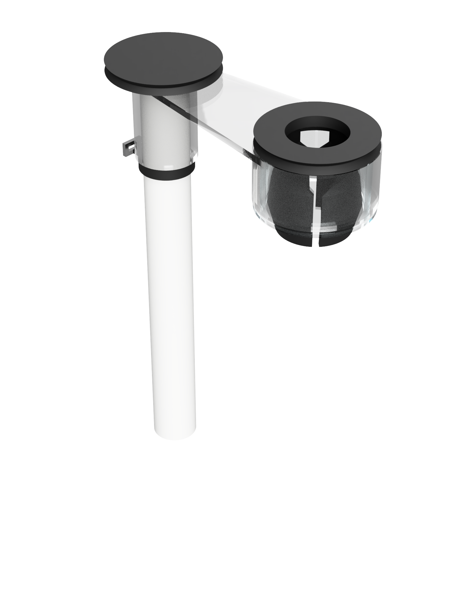

[<img style="display:inline;margin:0" alt="CAD model" src="https://img.shields.io/badge/Autodesk_Fusion_360-CAD_model-orange.svg?logo=data:image/png;base64,iVBORw0KGgoAAAANSUhEUgAAAEAAAABACAYAAACqaXHeAAAAAXNSR0IArs4c6QAAAIRlWElmTU0AKgAAAAgABQESAAMAAAABAAEAAAEaAAUAAAABAAAASgEbAAUAAAABAAAAUgEoAAMAAAABAAIAAIdpAAQAAAABAAAAWgAAAAAAAABIAAAAAQAAAEgAAAABAAOgAQADAAAAAQABAACgAgAEAAAAAQAAAECgAwAEAAAAAQAAAEAAAAAAtWsvswAAAAlwSFlzAAALEwAACxMBAJqcGAAAAVlpVFh0WE1MOmNvbS5hZG9iZS54bXAAAAAAADx4OnhtcG1ldGEgeG1sbnM6eD0iYWRvYmU6bnM6bWV0YS8iIHg6eG1wdGs9IlhNUCBDb3JlIDYuMC4wIj4KICAgPHJkZjpSREYgeG1sbnM6cmRmPSJodHRwOi8vd3d3LnczLm9yZy8xOTk5LzAyLzIyLXJkZi1zeW50YXgtbnMjIj4KICAgICAgPHJkZjpEZXNjcmlwdGlvbiByZGY6YWJvdXQ9IiIKICAgICAgICAgICAgeG1sbnM6dGlmZj0iaHR0cDovL25zLmFkb2JlLmNvbS90aWZmLzEuMC8iPgogICAgICAgICA8dGlmZjpPcmllbnRhdGlvbj4xPC90aWZmOk9yaWVudGF0aW9uPgogICAgICA8L3JkZjpEZXNjcmlwdGlvbj4KICAgPC9yZGY6UkRGPgo8L3g6eG1wbWV0YT4KGV7hBwAAEtFJREFUeAHtW3uMXcV5/2bmPO69e+++14/FLsShTrVLGxrTIFAKa6VFzYM2rbT+L22UqkQpqlRFkFbiDy5Vg4TUSkWKhLwtUoA/2nrbKDQPmgrhhUJTWi8NSb00izEGG9a7dx939z7Pa6a/b85ee20e3nsvLEragTnn3LMzc+b7fc/5Zkz0/+X/NgJiB8gXx44dkwfW1mTl4IKZmBgz/M2ZmRExgfvs/LydA/+tVBozc3NzplgschvbDvefvmIMMdHq6NGjbqezN+aYOoH+5vhxx2AsgCIx1nvOsPdsQGOMmLnvPkW3Eh0+XIy3Ev43f/fodR/OiM8MZuRNRhuFj2ohqIk2dVfIFaPjc1HQPGuS5PTZM6fO3n7XXy5v7b/1+fjxolOY3ysODQxompzEOKIrSekaAOb0yNycOFy8SPShEyfce+ZfvDETV2+PguBTu0TtF8cGBRmRMlEoh4R0SXgZkm6WyM1QIhyqR5qCxGyA4HOa6JUkTn4SNIOXkiR+aWnl9dO/9gf3L24Fg5+NgWTM3CqBegJi2gajKwCKRZKomCvRA88+W7j21I9u8ePKb4mgcZtP4dVOElBUW6NfkD80WTofJ8x3ZpidJi7CNSQzRLIPIAwJygwp1TMi3PwwuT0DpLK9pB2PGpCnZpRUNYkziU7mkjA6EYb1E9XzpR/f8KXiBWnhEdsFoWMAWsQ//siDh2Wt/GU/rt3aI6JdJmpQvValZhjp0LjJdYVlOeyVZWQ8TM5SDrhan+XfqCZBjVCbhnSDjA6MEEoL1WeMOyJEZrdU+d3S79tNfu8wyWyBAi2pHsTriTFzSRA8vfyjk3/+0bv/osb2Z8uHmDfvWpx3/es7/PF4ccI5XJyJv/nV236v//wL3/Ag0nGzSnWwJzIOrIEjY5WTo25NDrmrFGmIPIHAdywARHiQBF+Q6kdbZiRJw8DEG6Q3lkiXnzfxuVDXRM4Ib48RPful27uvr2do303Z/p6bcqPqCfR5hqaPQc+OoOP2SkcAzL9ZsSyUwdJBVQXh7r6GUdlMIklBKUkbSLNM6Of883iWF/j9zlPalAz0fUsRsBVQA6I+RkmxxJikAUBeJL3276Z+6lSQHftKxs8NfRSNnplde5INzfsLwMHRgp2pcrPVBOQ1mhVXuOAaDBsYRzGIvsYvkS8beAYBF0Qff267sIpcBgwMpnBgN8QgxD0P8WuwOTnEQx86OHpZ43f/YEcS0BoySKC1UUxBVDPQWEzKh6X3Ke8YGnFXKDEs+m3NpzX0Fe4MCtsNmEWUoLpKcmDPL9lOE0XmPkvotj7M4tJxCROjo0RTHMPaw/hpvuuE9nhlUgLo2Hl0PPz2OsLe1GurEPro2hcfumsXG0AETVZFtzNAVwBoWCnQDz3XpHVMsdaUERENulVrB4T1kMyIy+ulU2MJ3269rCckwBFhUNaeSgr7h3s/wn+/d2xsZwAg5j8mDyBAgKYQwjfoNsiTEUh/tzlcBESimQPTZisU0uFqfwtynUsrv2f/YHtvgoaICprQhCmKKONINoREqSG0j1e6dGUDEiGSdDJGIBTGxDQACC4y/O2+zriACr4xegFQQ5ADOwIAY0OIllBZIjAgxJmduoPg2XcV5XxlenyFZ3hLyC5ANwiuKDLQu/qGS5n8jRj269SGIewKAGM8rU3Mk4W1N5QVMRUccB9ukAm8vDBYrBU6jqiO8K7aSKjS1FQFA5uxpihhlTIamiRjrBnwSgAbjMeYMhqSPADRn/foqqEMXTXg01BeUNbxQUcVQabeb79ZOmk/dfn33+53dwAIiUAsHZaN4S4nJE9pWP+3AsDNXKgJRSEMZkIeOub464h9pHS0C9ygDnAbQpXrmparSRgmuowWDaVUKISO0T1uRCpYXkiC2dfjusoXatfu7ancOJpt7KL1w9mRxkM8m5m5ceA/zY9XLF0BANakKgD+xJDCXogm6zQbxpYIMOEsDX0qIZXAUEKvOXL00dNHQx/yi6hCaqlkuWnmNpr0D9XYm6nE/umkX6z2O+PNhdHRBJadR71C+a79+9aF2RU6APFuigAAoNBKAdiTd3mOFx0LE8+/+nxNLkBKIMLcBOEiKeg1Ygft+lgPN+XZRPh//PEHnvvmW6fz3CWvMKa4D/XkJIlJmqSR8ZKY4BbFGSiLBZs/u+3SEQBPbw6vk0AbR0LkmVBDGRDF+trivuV8jq26gFSAbMHuMg2VjYTGxlq+uu5ufH+x78Z7pr6/gJ7yxB2H1Om1A3pufNrcW8SgF4fjRx6a3xmW8On0Yt/jZctB2N/bvXQEQGtwSO6mFwCRmBm7KTtjNGA16O2B0coIWHV4CCyDWT40WrApwDvdNK76Sbl/7p6pf14wxXFPFE9GN0zNYtU0a1W42PrQNu6bwGyj5aVNLsrrpe+39Qs2C/Sk4Q6YnLom9GSVcIBINu9SIvEJVLbinA6AgYcUEAVxIuqxQ7mcsw9dHBAfWlXa1pffu0ZdAWCUC97CPQEECevXWvexW/SzMOieA8JBPMCBuwbx3Ba2AABERkkhdTy6K7fvsT/53J1M0uzUHTb/996Rd+WRulIBOF5reJhzTHyangOlKF7OA+HM+VQiGCQmHrELgFAkvRx5JFUfbMi+XYN/9b37v1C/4UtTf000RZwEpZE5cd/TpLdn/e0nO7p0BYDg4P9C3jfVfiZSwhYo32UvaQFgw8jhsmW9zJJWA1ADj42nyAKR/X05JBD6p1546O7P6cT8mThy5PkWNQzGLFLq71UStDVu694ZADNpdyOseWMWw8SlnMczKZeTGHB8CHOZcLb8VvFFgUI5jBwfG0ZEkCk8wq2/abIZLxm9et+nm5H+9Nm//9ozEK1Hlsu1JwAGewcrafzVVDpGxAw9TROHix0lQtPZp9fOAGiNoDlqTzWfDRvLAEuA8gAADB+7CLyG2MP9hQjpZJ5q6JEgWcqKAKWA7bAAiWDlJUcG5TgzdABL+123kHRuKfRU60vffvDZME7+pVYLnpk/FZwEIPXW5zfvjDx/uqPSEQBjIyPpB2UG9IEyFI6I8D8jgMQQuA/9b3EfqQGqhoIWA8wdvlIiHlCoDohvzZ7T4s3aOSeqv0FheV/i9u43ufxwLtNTuA06dVulVqeBgWBh4Z8efBEu/z9CTSfeCOMnbz7ylQa+2hqGp9JW6QiAC1/YshZgy86SznafxV9LBzxOjR6Lwko9ocVGRG4WqzkQnoUHZQ9ppw73CJeA6LAAYCAXjWWVNJfJrPWaKDuiRXYIiYa805vr2etlMnsB7m9Iz9DAK//1pxjhAXO8qLAxcclmzIU5XuGhKwAwbabZxv9YuWE9gLUNiCPWf8VGkBXEUDXQdG49oqpuguugxfWIZ+uoiHpMaMNkhTS3YH+J9DgrPIZCvq0saP1lG2Jgk4ACd0CLzLDW2eFkpD/jZ1T0eTR7oFPi0Rfz66IodoMgkuUPy1cKUVNZRMDDCVJwNcEaf34popWGpiZUoF5boWqMNQH6DItlLIjWSEZrMJjLpIMlisOyrRHfo7odN8K4UVihqHJKRqV/dcJXHvY3zr6g3VxufOnRP/wEk2COTcL3tF+6AiBKsKC3CCDKh+43EcRyQK7jGABIqK6i82sJnVmLrSRw0qNWK1FYPUv7/SVykTmykAEo6A0qjCdnfG1VuKcGlkG171QPxGaQVOYANSolGBJNhZzPUkBYFXGztktXAEipwF9MDmSwAazBMjHXdQgrzwE/AoIKNns4q8PeoQWSBHc9GdoF0sVZ80hb6+W08N8wJhIwLGZJXJHJSolcpX778a/+ZoHVAJ+4ONzl3d/hd3cAqCw7c1ugqGYd2R2egw7hGfg97IDngZOb/zFKvDW4AmfAwPhYL3CzrTUd7QpXHgfZ4I2VhVgVvJFfvf7qz9oeM8W21aArABTyIHb6mI+LkcoAIOKg3wIAQ+gVaLDPB7dTQrkN7Aa4F9MPTldocSO0gDiQEK7sASwLgQhofEu9iBQD4FJQw74o7ErOd37XAtBGKqwFcVcAmBgbQ1buQABGqoUGW9wYOg6xbwFJ8HqpdyBP1+3zU0LRxoWXyAA5RHx04tUq/fhslV5fbtDSekgb9dgmRnlyDkBzIVZc+ZldARcLDKOOhQcCKlVdXCTPkb9eeuTOg+LIdIJNgbZo6soNKseNeWMA+TrLOc7yrkG0+5EYTZohOflBSrw8XT1aI4GU2X8vcsY4QWYIiyUYyQwENkIwWa5AcuBDm7AoPJKD8NBHcjHNAkuDO2VdKZANFoijBPBgOITEnmFSLxH178YuuptGZBam7V86AmBufBwZmWn4+kxoYhz04AnBDnKqeqmm6WoYa12vwwYiFnB7KMEhiP1DTZv5PbMGlxYZiDwHQ4IKHvIGYK+G6iBeSCqBNPVAOxu1AFlhvOfYAKohAZgPHcr5kvJArgeJlkJWBcOi5quNlX8c+MJjZ9gViiN2a2zbCHQEABJw9gOQwRDcYEOI3UBwFYSswjPWE0UF7NexvEofObFmDsvfKo32punvSoNzB9pmhfsAAHKpWC4IPZhVqh459HrZRJVmMh9Hyf8gSXwKjc81E7l0vkzlxYquvLHhNM4uNYI9V/WGvzMW693BY0s8IagA3ER7pUMA0o8Y1wmlFhEEgFNDmCdohSivNF0qNMqI5AIsjDKQAhyDwT2fiWgPNnNZ9IXBRgdgQ9JII5coPSVVqWqeQ5Lx4Wy+8NRnjz712hVJQYtv/dvmXKycYBJtFtaltgvbPUileeTOTw5JWjulSPdjHY+3ZBfIQz0uHRppUs/Bm8kfHiG9Dj2FxZbVEjVhJdf5zAt4lYOjKHDsIwQ2md0v5u/6wd9unUxxgpy9Bw/ZOS7Mp1vyvBCbRqNxJE257b3pBTtI7RPPXTsDYBPtR++6rUc2lk9Bn/ckvJ8DIeAB+czAx3cntGvfAcpdO06mvo7zYGUSFZxxatYpCKA1MJgZR8Rer+e8VvL+6Jq7n/q6OXrInUU+9Dujs9gHsAS1zVEmqp3SkQq0UNufvzl4s/HthoJr43wAw8kIRLDmSw2HBvloS/BhUrDWxskgRwhVSELCsSi2D8bxtFqo5OjLz448xa+mnzygj0xP81pox0pbPnPLrCxneAcGoldlH43lLFL9aQsEfwBAUL1eoWQDix0+FsfV60EF+R7WiKjCc0U1yi8/8XjPG9xzcrp9I7ZlTh09dgoAQURtXxC/jvwumJ8aBgBigyI2hqsAIV5bBLPh3QEAQQqQEECyx4NUYF2MO/Z9YcGnoCNWgN53kb8cpY4BGDvJAo9JS7HOiQ2sgdhjAxWAgQcOeRebipowgBp6L7HxzyBIHKMROBjZAkRJ157zazeCu5yQTn93DMDI+EQKAI4jtGJ4VgEmnnnJcf8G0mDlaoOi9VUAhBdcFU58KYDg+EgeZtFSImBAGTtpe9rnHbx0DEDrqBxc2ApHgCCeXREI2qx44GRoCVIQrOK4HM4EYPkMIFABglAMgI9TIIq3wDtez9u+XVw6BqD1TdiAZct5vLAsZBB4zYvCCyTs/NLGepmS6gaIhoJAChgEzhVwAgTG0+r/7PybtrvtuIOXjgG4cFZQiJJVgVT1AQKIZ/pRGZgAxrCE9UFzFbaOkyRcrKgwvQDB6Ip99wFdOgagNV9wsMSk8JK1JQktBHhDBFEiLdQEbawtU9KopXaAOzMIfIrUqJ9OAEon070B5ThLnBAF53l/dBMElgJOk8H94c7ngM6uNChYXwPheJ+ix1YDT6bKP9s94ZkO0f21YwmY5CUxSs6VKzwIrD60m/fIeAOcAUnvLPYOdkZeXjG0WoLHwxmh1FOgEzQCITTEAuVpe93xS8cA3EdFO1k/665mENBxfs+eGkWChBMj9iQILw8gAdB0qiBd8dK5CjLC+PcQzHiWAxs+CwvADM3wyx0vHQNw772pJDei/etY3q5yRgfn/HDDyRdceNs0xpqA7wwIjvjRS6WYFs5znoDDfcgBJ9WTFICJsc3tth2GoGMArA0DFYeL32jmkOP++RGf+jKSI3w+NyNANHBAjhQYMK9ZPRIoxwuvrFGMbJE1FgAASUXkyT640jEAmPIFa+Y7zu/Hifxa3ne+0wjptQS74sj5ObAPLtJeDjJFvGEm8By/XIqjV9/AbgknAbB9HhmBNTLKXGpT7PMOXqw2dvM9JgyD4JaWo3fc4WbM8x9CemBMaP3L2AG+HonMcWSMr8GBRxVCFjIqps/fPk61ld7v5b/48GfSXN7OLoNb8+0oH9DqzHcmngmYffK0PL02q49MTXFifH6zfovbHJucVKb3lQ9V4+RjsJWfOLMS3/zDkysfu/4jQ/fz3z/I0rUEvM3kBZbKGHdC7sU/rRlgUKbZ3F1aipO/sqc4/Z/nL32787/eDwDejopLQLljahaHZC6qzdt1+Fl/x4B0Y4B/1vHZOfr+F0Kd7ECpFONyAAAAAElFTkSuQmCC" />](https://a360.co/32TY9qw)

## Introduction

I'm sure the foyer chandelier is a familiar feature that many homeowners have faced the tricky conundrum of how to change the bulbs when they burn out.

Both my family's home in Pittsburgh and my (rented) home at Georgia Tech are down to one working bulb, so it was time to figure out a way to change the bulbs.

## Alternatives

* <u>Call a handyman</u> - easiest, but probably most pricey unless you already have one visiting for another service (?)
* <u>Ladder</u> - even if you have a ladder tall enough to reach, the particular geometry of the foyer may be such that the chandelier is too far from the walls to use an extension ladder and too high for a step ladder that's tall enough.  You may also not be personally comfortable with such a tall ladder.
* <u>Chandelier winch in the attic</u> - according to my roommate [patrick](https://www.pgrady.net/), some houses have chandelier winch systems that you can access from the attic to lower the chandelier down to service it.  Neither of my homes have one, and honestly I think few homes do unless they have a truly magnificent chandelier.

### Inspiring Products

I was inspired by [this product](https://www.amazon.com/HighLight-Chandelier-Light-Changer-Ceilings/dp/B01N4OQP7T/ref=cm_cr_arp_d_product_top?ie=UTF8) that my mom had stumbled across which consists of a long pole with a contraption on the end which can grip a bulb.  Here are some similar items:

* ["HighLight" on Amazon](https://www.amazon.com/HighLight-Chandelier-Light-Changer-Ceilings/dp/B01N4OQP7T/ref=cm_cr_arp_d_product_top?ie=UTF8) - problem: at the time this was being sold for almost $100 which is ridiculous, and now it doesn't appear to be in stock at all
* ["ProTorch" from Lowes](https://www.lowes.com/pd/ProTorch-11-ft-Steel-Light-Bulb-Changer/1002655228?store_code=165&cm_mmc=shp-_-c-_-prd-_-lit-_-ggl-_-LIA_LIT_143_Light-Bulbs-and-Commercial-Lighting-_-1002655228-_-local-_-0-_-0&ds_rl=1286981&gclid=Cj0KCQiAt8WOBhDbARIsANQLp942Kq_-ceao9ymPISOIzTg_5fbesCobAzODCkuOl6a4bEADG9fDMecaAt83EALw_wcB&gclsrc=aw.ds) - problem: only works for downward-facing bulbs (our home chandelier is upward-facing)
* ["DocaPole"](https://docapole.com/products/5-12-foot-docapole-light-bulb-changer-pole-high-ceiling-light-bulb-changer-extension-pole-extendable-light-bulb-changer-for-high-ceilings-and-recessed-lights-light-bulb-changer-with-telescopic-pole?gclid=Cj0KCQiAt8WOBhDbARIsANQLp94Y5W0m3Lq3mpI9TfzKe-_AHB8gcklX5367GCsyD2sW1kIXXcVDzIkaAqE4EALw_wcB) - problem: doesn't work with candle-style lightbulbs (only flood-style)

<figure>
  
  <figcaption>HighLight</figcaption>
</figure>
<figure>
  
  <figcaption>ProTorch</figcaption>
</figure>
<figure>
  
  <figcaption>DocaPole</figcaption>
</figure>

### Design

I decided the HighLight design was easy enough to make, so I decided to design and 3D print my own.  I tried 2 (very similar) designs.

<!-- 
 -->
<figure style="width:20%;float:right;">
  
  <figcaption>Design 2: single rigid part</figcaption>
</figure>
<figure style="width:20%;float:right;">
  
  <figcaption>Design 1: belt-coupled rotation</figcaption>
</figure>
In the first ([download](https://a360.co/35HgJRA)), I designed a rotating mechanism to allow the bulb holder to rotate (belt-driven coupled to pvc pipe).  The idea is that, by holding the pipe stationary then rotating it, the bulb can be rotated since the pipe rotation is coupled to the bulb holder via a belt (e.g. a rubber band).  I also considered adding an inner pipe inside the main pipe (or even string-driven system) to decouple the outer pipe movement from the bulb rotation, but decided to start simpler.

In the second design ([download](https://a360.co/32TY9qw)), I decided to just try the simplest possible thing and have a single part rigidly attached to the pipe.

<iframe style="margin-left:30px;min-width:250px;float:right;" src="https://myhub.autodesk360.com/ue2f9c890/shares/public/SH35dfcQT936092f0e43c6936a430b468944?mode=embed" width="40%" height="350" allowfullscreen="true" webkitallowfullscreen="true" mozallowfullscreen="true"  frameborder="0"></iframe>

<!-- 
 -->
<!-- 
 -->
<!-- aoeunstahoeu -->
<!-- 
 -->

The CAD model for Design 2 is shown on the right:

## Printing/Assembly/Usage instructions

#### Materials

- Sufficiently long 3/4" diameter schedule 40 pvc pipe.  I bought a 10' section from [Lowes for $6.46](https://www.lowes.com/pd/Charlotte-Pipe-3-4-in-dia-x-10-ft-L-480-PSI-PVC-Pipe/3133085).
- Design 2 (recommended).  3D print with the "fingers" "pointing up" (the obvious orientation).  Use the model for the appropriate bulb size.
- Rubber band

*Tip: use a loop of paper taped to the end of the pvc pipe to probe the bulb diameter.  Try loops of paper of each standard size (1/8" increments starting from ~1"), stopping when a size just barely fits over the bulb.  This table of the [most common bulb shapes](https://blog.1000bulbs.com/home/light-bulb-shape-guide-chandelier) may help.*

#### Assembly

In both designs, a grippy/rubbery material is needed to grip onto the bulb while spinning.  I recommend just weaving a rubber band between the fingers and pushing it all the way towards the base of the fingers.

Fit the 3D printed part onto the pvc pipe.  Depending on your printer and print settings, it may be a bit snug or loose - in the models I assume all walls will "expand" by 0.1mm.  You can sand it if it's too snug or drill a 1/16" hole and use a finishing nail to hold the part and pvc together.  Alternatively, you can scale the stl up/down by a couple percents and reprint.

<figure></figure>
<figure></figure>
<figure></figure>

#### Usage

Screwing and unscrewing bulbs should be self-explanatory, but I'll explain anyway for completeness.

To unscrew a bulb, just maneuver the pipe to fit the fingers over the bulb, apply pressure, then turn the pipe to unscrew the bulb.  For down-pointing bulbs, just keep turning until the bulb comes free.  For up-pointing bulbs, you will eventually reach the limit of how far you can turn since the socket's arm will get in the way.  When you reach the limit, lift the tool up off the bulb, reset the rotation, and fit the tool back down onto the bulb.  Repeat until the bulb comes out with the tool (the fingers should catch the bulb).

To screw in a bulb, place the bulb inside the tool, then maneuver the pipe to set the bulb onto the socket threads and twist the bulb.  For down-pointing bulbs, keep turning until the bulb is screwed in all the way.  For up-pointing bulbs, again you'll hit a limit.  When you hit the limit, lift the tool off the bulb, reset the rotation, and fit the tool back onto the bulb.  Note that you may get unlucky the first time if the starting point for the thread doesn't line up with the range of rotations that you were able to achieve - just lower the bulb/tool, rotate the bulb 180&deg; in the tool, and try again.

#### Tips for twisting the bulb
While twisting the bulb, apply force into the bulb (force down if the bulb points up, or force up if the bulb points/hangs down) to make sure the bulb is engaging with the rubber and turning with the tool.

You may have to apply force outward from the chandelier to prevent the entire chandelier from spinning (or use another pole to arrest the chandelier rotation).

Make sure you get the twisting direction correct - this may be tricky if the bulb is pointing up because the directions are flipped (rotate pipe CW to loosen, CCW to tighten).

<!-- https://photos.app.goo.gl/7iZ7MoEbTFxUg7qh7 -->
<video style="width:50%;float:right;margin-left:4%;" controls>
<source src="https://video-downloads.googleusercontent.com/AGQNM9JmZWl5OGTJ-zoXVMhyUhLSEYzdx_uL9Gj4hY3q6g28QSuOaB7T_60tacDiyZZTQW5iWIK69lcQlSiGI5IlS4QPqoGPW3YWJUnTe7Cwmskr9Kj-TKFKt0eX4GXgkLE3-L9wriGtjwkARMGCWcGU26_GI5QW8zWXy9r9-ir6zKiARIgxL7t9y5DatTfuSAknqMLqqXAaxJWvkmwiS6oet-4S1BJqLQ6-qBZLCgaSqi7E_xRBabHbIpBbhkcwJh4kJiA37wSknzbcdhExVrulmlOWtjqb_vJbY3TIH6Jz9uiaZ85Iqv_3gxu_4rCGpIi6zzDmVzqochnj59gdvXo-EW-cMdzX7fUf63rA6m_plM2U2NAvo5jzwx_3rqg2cYNJ78FKl-0Za2min9pTUSf7w6oh8I3fqB0iNSSmilaNz9joFwxK9yBh_Ug5YJ4OAF8EgTNtdy_gWvIM7cZm2EZJQio7tuCawtJG9e5a0AVXA7wqnLe_8pTyyhJowhGSU0nc-zLpmHe7JEfY8Y9k2jorXRMJvTNQwqAF8jnCQ-ERkXXrzo59_ehP64z81nt2oBQav-ReTQF3PmXT6vvP5OsyaGbbxBNXP8E8rWb3M3tnDUvF4On3SvrgejuSMnMBW0uifFbByAvdIRhiCn5VE6GDrSGeo6aFu3FIe1Bvwzxu7zzwW3dvGk7BGJdbw6M5bjAMar7ZrsMkFAz0Rgsp8K3OpYEBlBaDtROJqNAFmtomNE_NCfsL0Lia13UZeFhyvBraB8JH0e8EHPmBng-n_7q_J6qwXRMZnv4sisncVj1boj0yqBDxAycGlZCG6SjYJF8kdemf_Q-zF0OOusw6Z0_zs8c2gMfsFqE7SQHmhuwjxQMDvrRNkXD_RQeqrTBnZx4q9I1VCB4lG2HbIyH7w6lOcs115ISXUqFWrd73h6BZpItG58ega84?authuser=0" type="video/mp4" /> 
</video>

## Results

I decided to print Design 2 first since it was easier and it worked fabulously so I never bothered testing Design 1.

The video on the right demonstrates pulling out a bulb.

