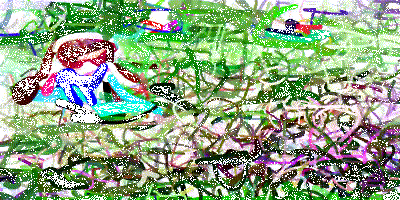
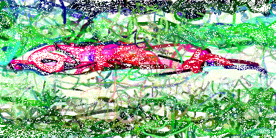

## Introduction

This is essentially the same as [CLIPDraw](https://arxiv.org/abs/2106.14843) but I didn't discover CLIPDraw until after this project.

This was a class project for CS 7743: Deep Learning, with teammates Alice Dumay and Mengyi Tang.

Please refer to our (informal) paper [here](Chen21_diffvg+clip.pdf).

Some [powerpoint slides](https://www.dropbox.com/s/8i2yvy0hf4gzu2g/Gerry_2021-12-09.pptx?dl=0).

Feel free to reach out to me for code etc.

### "A small girl in the grass plays"

### "A drawing of a beach with a pier on a cloudless day"

### "A big red dog laying in the grass"

