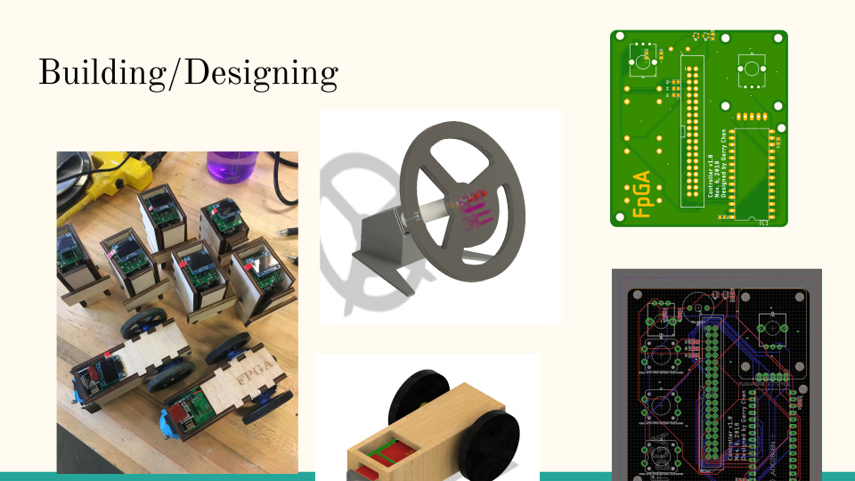

  <input id="collapsible" class="toggle" type="checkbox" checked> <!-- delete "checked" to default to unchecked -->
  <label for="collapsible" class="lbl-toggle">Table of Contents</label>
  

    

- [Summary](#summary)
- [Presentation Slides](#presentation-slides)
- [Project Proposal](#project-proposal)
- [Final Report](#final-report)
- [Random Pictures](#random-pictures)
- [Random other documents](#random-other-documents)

  

<!-- <iframe width="100%" height="315" src="https://www.youtube.com/embed/Kf8LoKmhIvY?controls=0&autoplay=1&loop=1&playlist=Kf8LoKmhIvY&playsinline=1&mute=1&modestbranding=1" title="YouTube video player" frameborder="0" allow="accelerometer; autoplay; clipboard-write; encrypted-media; gyroscope; picture-in-picture" allowfullscreen></iframe> -->
<video controls autoplay loop muted width="100%" style="margin:0">
  <source src="ece350_vid_compressed.mp4" type="video/mp4">
</video>
([video youtube link](https://www.youtube.com/watch/Kf8LoKmhIvY))

# Summary

This was a class final project for ECE 350 ("the FPGA class") to implement something fun on an FPGA.

To make a slightly more flashy demo without as much FPGA effort, we decided to leverage my prior skills to create these robot racers and "checkpoint" sensors.

We used 2 FPGAs: one to read the steering wheel inputs and send commands to the robots, and one to receive the "checkpoint" sensor inputs and display the score/game state on the monitor.

The FPGAs were running our pipelined CPU implementation, with the game logic being implemented in "MIPS" assembly.  Of course, this was more of an academic exercise than a realistically useful way to implement the project.

<!--  -->

# Presentation Slides

<object data="final_presentation.pdf" type="application/pdf" width="100%" style="aspect-ratio: 16/10;">
<!-- <embed src="final_presentation.pdf"> -->

<a href="final_presentation.pdf">Download final_presentation.pdf</a>.

<!-- </embed> -->
</object>

<!--  -->

# Project Proposal

<object data="proposal.pdf" type="application/pdf" width="100%" style="aspect-ratio: 8.5/11;">
<!-- <embed src="proposal.pdf"> -->

<a href="proposal.pdf">Download proposal.pdf</a>.

<!-- </embed> -->
</object>

<!--  -->

# Final Report

<object data="final_report.pdf" type="application/pdf" width="100%" style="aspect-ratio: 8.5/11;">
<!-- <embed src="final_report.pdf"> -->

<a href="final_report.pdf">Download final_report.pdf</a>.

<!-- </embed> -->
</object>

<!--  -->

<!--  -->

# Random Pictures

  <object data="https://lh3.googleusercontent.com/tl-nt9_zKe16UH-Xx1JXxqvt5_b5tDWlq_3t-kb6oxDuUyElxrGKVLNeOpHdYV0QKDsPTpMd2BlPKq8Ia7RRS-Er3VGmkxkrfQuXpF3Oa_LvN8H7QUJSrWWJ23VXHghDsZyKbq-2bdQ=w1920-h1080"></object>
  <object data="https://lh3.googleusercontent.com/GIOJDx8suD89nrlqvq0kb7vyhG-sGANN-tLuWTndIW5sW_ZEusD1eQs-Vt_eZ1CWUEKIGjl0FvXKXTdGjiv2EaNk4dz6tV16g3-929RlnCG3x5PfUz3Tb4MlXCWCGEvS9uYEInvirU4=w1920-h1080"></object>
  <object data="https://lh3.googleusercontent.com/iPj8a0lUqfIK_eKZCsTN8_Hvg4cM-EnJ3lcQnpOKmSpoFyvPcaDOowy0_WJM4OcGqKBnMSUtG7b7IlfTkNVdUh4FjjWXmgYvg-4VT2GrdtmCfvE9Y8qYIrueOnCMlF1YAc0insJz5r4=w1920-h1080"></object>
  <object data="https://lh3.googleusercontent.com/tK6-nGfkOcmkvGox6tegOwZnSZwRTTKeDFNCXXOe1vQ8wksAyCRsari40h1xYaX2FkWb8mOkU9ju61ZhA4D2TwCs4Rq3M5oPJ6jc5xWwrAcLZ5NnbOez-LRaJH4rdkCrBhrCQ4iiE8c=w1920-h1080"></object>
  <object data="https://lh3.googleusercontent.com/A2ynoL83y-09XlRFotb15wupOKhke4N9A9p_sguqGO-O1qzlg-ItH20_ar_TFwoY-AJWgMc5-qN40wqcQQkrL2lKSGfXQiQ9QV2-f-l6frcWcYGoBWuumcQz-Y1uVWtaseuTRPhTmbk=w1920-h1080"></object>
  <object data="https://lh3.googleusercontent.com/ejotXGtTEOVvCOt-5rk39uCv813cUXJP4yQ3jy3P615vr33MwmqSySo5-rUl9eeCk4328_tgyJbXEO3Ha7zMn08YPxzl1L_TDtQf-EovekBCfqfL8v0iVgG1PDteq5iwpstFvCvrEVg=w1920-h1080"></object>
  <object data="https://lh3.googleusercontent.com/x8xaPUJFERXxwXf7wEG7peEPhE5C-usfoDMYaGcXtFX9dRdER7iNZrFmEgzII9ikA5A1b-RVnqNnh6IWKAFisV8CcIK0wDbx1F0j1G87BCoc7uYZJiW4XFs7ce9tyWgwU4AuYslOx7Q=w1920-h1080"></object>
  <object data="https://lh3.googleusercontent.com/6zgiyUOI2OwAhcdoF6sVBMKD9UEw0Hj8wHRyaL7MzNJG8TK6ALmUyRXVJWY-xOsQPxZAaKFEDIxC0Y2-4cXRG0e5KoBAClBbOO8wV9ceKIoKNjntbExgHqoXUrwFINM45Icb3fidLIc=w1920-h1080"></object>
  <object data="https://lh3.googleusercontent.com/lqI2i3mok-noye31Mv5Bmi7bO-h_iKkW3PyxU5Q84jvjJE2dt6-CyyPyuLpwB30aDHmyFmrRUDmQq4SPr72FYhjDlGZmBDCPVlg1_u12BjLE96e2r0kJMoHvLIrQm01KDf3q-ianoQY=w1920-h1080"></object>
  <object data="https://lh3.googleusercontent.com/PJfKLicNxr3CAfggcPtaoMV5RxixMRIs131uitqdCgfXCP5xMr2DytD2JhxrVkS-zfgfrPH9SLWt6vw2jk544NTF1C9oydY_uufw1_BGg_1vhOFfiGXL3F_pbTgbqLnUv6cVY61yf7s=w1920-h1080"></object>
  <object data="https://lh3.googleusercontent.com/a9PtotvprdrB0fBeWyoUmxrcLS_zbKOmovsfvkc7Pp7j9gukbhtXwwILMivLYaHuyhiEdcMzj58qWlwm3jo1cWehaO0BArQG2EkrLORItL26eNvea1xrmUG_tRBkIaIb_lGVvEinqTY=w1920-h1080"></object>

<!--  -->

# Random other documents

<object data="GameRules.pdf" type="application/pdf" width="50%" style="float:left;aspect-ratio: 8.5/11;">
<!-- <embed src="GameRules.pdf"> -->

<a href="GameRules.pdf">Download GameRules.pdf</a>.

<!-- </embed> -->
</object>

<object data="UART_CommunicationSpecifications.pdf" type="application/pdf" width="50%" style="float:right;aspect-ratio: 8.5/11;">
<!-- <embed src="UART_CommunicationSpecifications.pdf"> -->

<a href="UART_CommunicationSpecifications.pdf">Download UART_CommunicationSpecifications.pdf</a>.

<!-- </embed> -->
</object>
