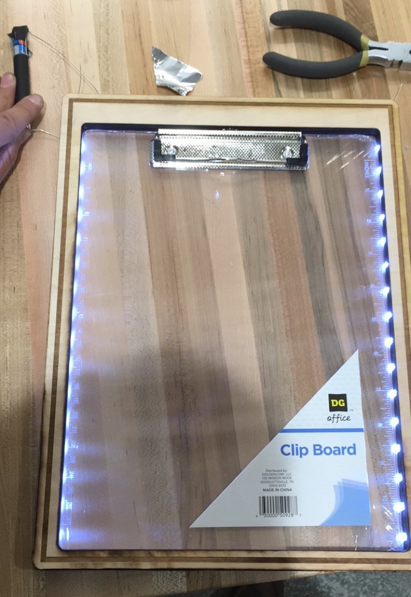

#### Disclosure
I didn't document the project at the time so this will be a summary of as much as I can remember.  I only have one singular photo (darn you snapchat and not saving photos I send to my friends) and no files (darn you flash drive that died and which I foolishly didn't back up).  Fortunately, I still have the parts from my final prototype which I will hopefully dig up and post better pictures of soon.
## Intro
This project was borne from a similar vein as the <a href="/projects/solarbenches">Solar Benches project</a>.  I wanted to be able to enjoy the outdoors and do my homework after the sun went down.  Since the Solar Benches project was just getting started, I wanted a quick and dirty solution for NOW - and even better, I thought it was a solution that could be portable and useable by all sorts of people: an illuminated clipboard!

Now this wasn't just any illuminated clipboard.  See, the problem with things like book lights is that if you're writing then your hand casts a shadow.  I thought it would be super cool if, instead, the clipboard was back illuminated!  This would also make for a more unique, DIY-esque product which would be more self contained.  It would also be different than any other product on the market (as far as I could tell).

In the end, it did work.  Really well actually!  I used it a few times before realizing (a) it was sad to work outside with no friends and (b) the only homework I didn't do on my computer was my math homework for which I needed my non-illuminated paper copy textbook.  Sadly, it went into deep storage never to be used again.

## Idea and Design
Since I wanted the clipboard to be illuminated from the back, a natural design was to use a translucent plastic sheet with LEDs mounted along the edges pointing inward.

I soon found that buying a transparent clipboard was much cheaper than buying plastic from Home Depot.  I got a cheap one on amazon for something like $6.

### Prototype 1
The next challenge was figuring out a way to mount the LEDs.  If I can recall correctly, the clipboard was something like 3mm thick exactly, which meant using standard 3mm LEDs would pose minor difficulties.  Rather than drilling into the clipboard and causing possible bumps on the writing surface, I decided to 3D print a shell around the clipboard using the newly discovered 3D printers on campus.  The shell would house the LEDs and wrap around the clipboard.

I successfully 3D printed the shell to specs after 2 or 3 attempts (failures due to warping and tolerance errors - these being one of my first prints and all) but it was pretty crappy and flimsy.  I discussed with a friend and they advised I might consider laser cutting instead.  Well, I'd never tried laser cutting before but I was excited to try something new!

### Prototype 2
I designed the clipboad in 3 layers of 1/8 inch (~3mm) plywood:
1.  A more-or-less solid back layer to keep everything from falling out the back
2.  A middle layer to hold the LEDs around the clipboard
3.  A top layer to hold the LEDs in as well as prevent the clipboard from falling out the front

I used Corel Draw and it was probably the worst experience of my life.  Never again.  (For reference, I now make a sketch in Fusion then export as dxf or svg or something - Inkscape and Illustrator have no issues with svgs.  CAD dimensioning makes life infinitely easier)

I sent the job to the printer and 15 minutes later, I had my finished wood panels!  I was in awe at how quickly and beautifully they came out.  I think I raved about laser cutting to all my friends for the next 3 weeks.  3D printing was soooo last month ;)

Anyway, I put my LEDs in and soldered them in series with all the positives in the front and all the negatives in the back.  I touched them to a pair of AAAs in series and it worked beautifully!!!

That night when I tested it, though, I found that the lighting was a bit too uneven and a bit dim as well.

#### Prototype 3
The solution that I came up with was to wrap the back plate with aluminum foil to allow reflection of light throughout thereby increasing brightness and helping to illuminate the middle at the same time.

I took a somewhat stupid approach though, and rather than just gluing a nice flat sheet of aluminum foil or something, I decided to make the back plate into a two-piece part with the center removable.  The foil would go on the center piece and by wedging the center piece back into the outer piece, the foil would be snugly secure.  The only problem was that the back plate was no longer secure and was all-around pretty lousy.

One final change that I made was to 3D print a battery case and have the laser cutter make an appropriately sized slot at the top of the clipboard.  It was much better and made the clipboard useable.

I used it a few times and it worked surprisingly well!  I wish I had some pictures in the dark with a paper over it but standard paper was completely illuminated very evenly.  The paper indeed helped to diffuse the light quite a bit.  Writing was extremely clear at night and writing was magical.  At this point, I considered the project a success.

## Issues
#### Double sided pages
I think this speaks for itself.  I knew I'd only be able to use single pages when I designed it, but I forgot about the fact that I could also only use single-sided pages.  Oops.  That's ok - it's neater and more organized anyway.  Plus, the whole "saving paper to save the environment" doesn't really make much sense if you think about it anyway.  See <a href="/blog/2018-01-03">this blog post for why</a>.

#### Falling apart
The back kept falling off.  Solvable by just gluing the aluminum foil and by screwing the rest together.  I don't think I used screws but I definitely should have.

#### General sketchiness (no pun intended)
It's a prototype - what do you want?

## Improvements
There's just so many things I would do differently if I were to redo the project today knowing what I know.  Here's just the couple that happened to pop into my head first.
* LED strips (or at the very least SMD LEDs - possibly mounted on kapton/copper tape)
* mylar reflective film (instead of aluminum foil)
* button cell batteries
* current limiting resistors (well, not needed if using LED strips)
* I think I'd be able to manage a way to get everything made in one, acrylic piece for not that much money

Again, so many things I would do differently.  Due to the whole single-sided single-page limitation, though, I don't intend on further pursuing the project.