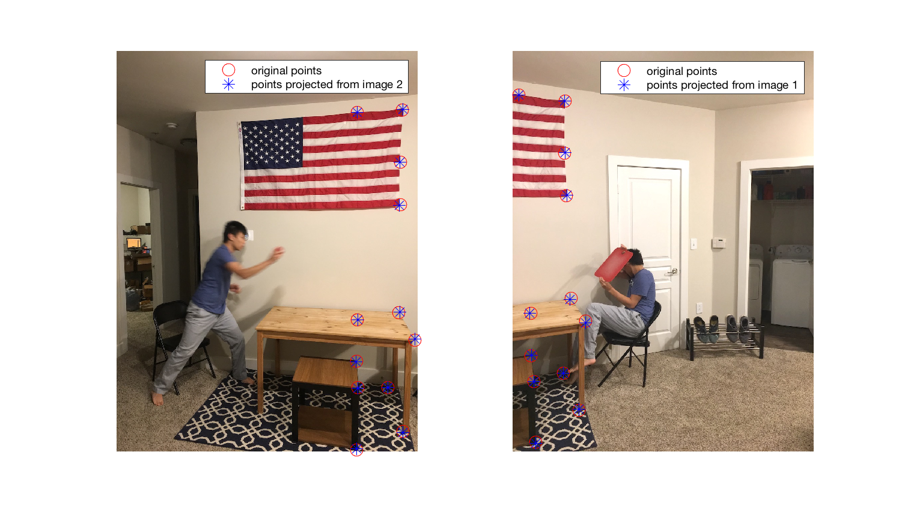

## Introduction
Image stitching is a straightforward operation given point correspondences between two images.  It can be done by first finding the homography matrix **H** from image 1 to 2 then transforming the entirety of image 1 into image 2's coordinate space.

## Math
**H** relates two coordinate frames as follows:


where _w_ is some arbitrary constant (we have to normalize projection into frame 2 after multiplying by homography matrix).

Given a bunch of corresponding points, we can represent the constraints given by the above equation for each pair of points in matrix form,


where _h_ is the column vector representing the "flattened" form of **H** and __L__ is some fancy matrix.

Because the correspondences aren't perfect, this will not be exactly 0, so we instead search for the least squares solution.  We can take this as the eigenvector corresponding to the smallest eigenvalue of **L**.

Please see [here](https://filebox.ece.vt.edu/~F15ECE5554ECE4984/resources/Homography.pdf) for the exact equations.

## Code Overview
The general idea of the code is to:
1. calculate **H** given corresponding point pairs
2. calculate the quadrilateral representing image 1 in image 2's space by transforming the 4 corners of image 1 into image 2's space
3. create a blank canvas (dubbed "new canvas") that can fit both image 1 in image 2's space, and image 2 in image 2's space
4. paste image 2 into new canvas
5. transform and paste image 1 into new canvas
    * note that in this step, it makes sense to calculate the "source" pixel from image 1 for each pixel in new canvas and pasting that pixel into new canvas.  The alternative would be to take each pixel from image 1 and paste it into the corresponding pixel in new canvas, but the problem is that some pixels in new canvas might not get painted and some pixels in image 1 might overlap eachother.  So in other words,  
    ```python
    for x,y in quadrilateral:
        newCanvas(x,y) = image1(inversetransform(x,y))
    ```  
    rather than  
    ```python
    for x,y in image1:
        newCanvas(transform(x,y)) = image1(x,y)
    ```  
    because we don't know whether the discrete version of transform is one-to-one or onto or neither or both.

## Results





## Code
Contact me for the code.