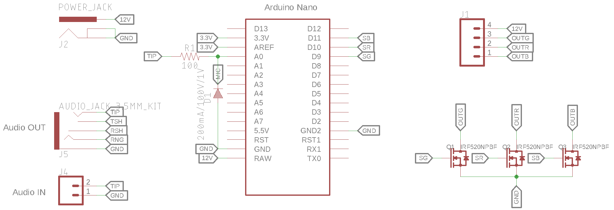
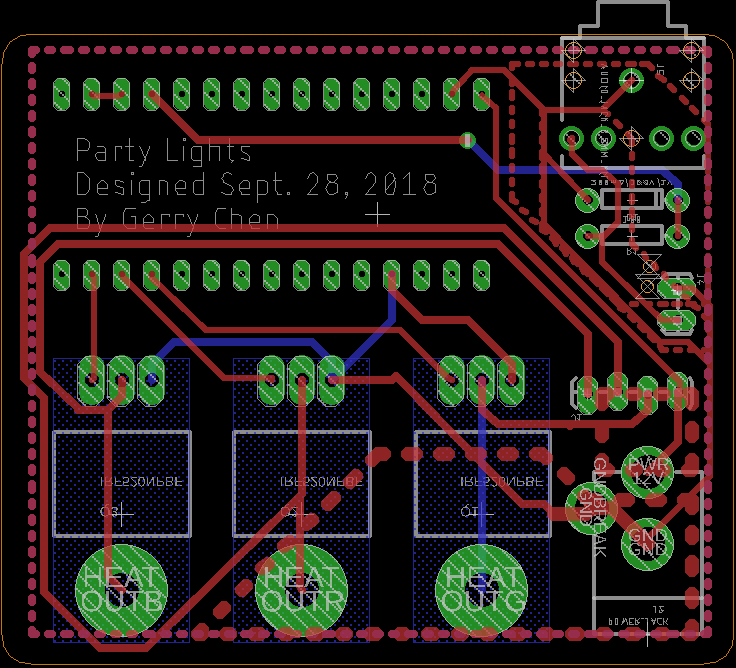

## Introduction
Each year, Brownstone (my living group), hosts an open party: Moonstone.  This year, I wanted to make my room special by syncronizing an RGB LED strip to the music.  I made a quick PCB, routed it in the ECE lab's Othermill, and uploaded some Arduino FFT code.  It was a great success and I received many complements.

Click <a href="partylights.ino">here</a> for the Arduino code.

Click <a href="PartyLights">here</a> for the Eagle PCB files.