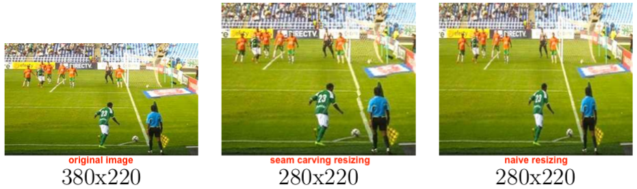
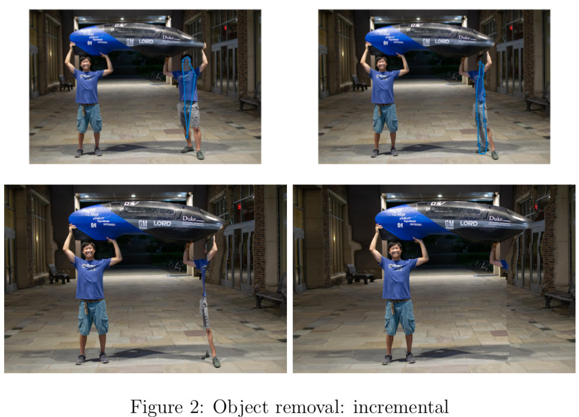
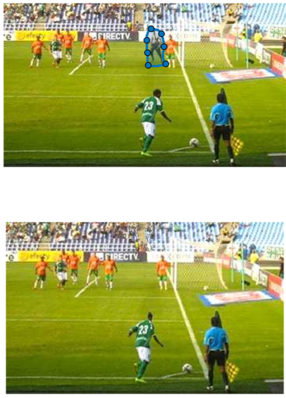

## Introduction
Seam carving was introduced by <a href="http://www.cs.utexas.edu/~grauman/courses/spring2011/slides/a10-avidan.pdf">this paper</a> in 2011 to resize images while retaining all the "important" information and only distorting the less salient regions of the image.  It does this by calculating the "energy function" at each pixel and removing the seams which have the smallest cumulative energy.  The specific choice of energy function as the metric for removal can be changed for alternate selection criteria (the original paper proposed something like the 1-norm of the gradient) and can be manually adjusted (i.e. with masks) to remove specific parts of an image.

<iframe width="300" height="200" src="https://www.youtube.com/embed/rTjMJkyKpwI" frameborder="0" allow="accelerometer; autoplay; encrypted-media; gyroscope; picture-in-picture" allowfullscreen></iframe>
<iframe width="300" height="200" src="https://www.youtube.com/embed/6NcIJXTlugc" frameborder="0" allow="accelerometer; autoplay; encrypted-media; gyroscope; picture-in-picture" allowfullscreen></iframe>

## Shrinking
To shrink horizontally, find the continuous "line" (aka seam) of pixels running from top to bottom with the lowest total energy and remove those pixels from the image.  Repeat line by line until the desired width is achieved.

Finding the seam with the lowest energy can be made computationally tractable with dynamic programming and can run in a couple milliseconds on my 2012 MBP.

Below is pictured an original image on the left and two versions of the shrunk image on the right.  As you can see, they look very similar and it's hard to even tell what got shrunk!

(Image acknowledgements: Thanks to the following Flickr user for sharing their photo under the Creative Commons license: inputSeamCarvingPrague.jpg david.nikonvscanon.)

And another example with the original image on the left, a naive squish in the center, and a seam carving resize on the right.

(https://www.football-bible.com/images/image/cornerkick-works.jpg)

## Stretching
To stretch, pretend as if you're going to shrink the image but then for the seams which get removed, instead double them.  Note that you have to select all the seams before insertion (by removing the all first) since, if you re-calculate the energy functions each time you add a seam, it's very likely the location you just added a seam will have the least energy and it'll repeatedly duplicate the same seam.

Unfortunately, I don't have a great example of stretching.  Images well suited to stretching are those that have at least some reagion without much high frequency information, but I haven't yet run on such images.

## Object removal
Object removal is done by manually selecting regions in a photo to make the energy function really small (to make sure removed seams include that region).  After seam removal, the seam insertion can then be done to restore the original size of the image.  It also helps to mark areas that should "definitely be preserved" if they are very close to the object being removed.

The <a href="http://www.cs.utexas.edu/~grauman/courses/spring2011/slides/a10-avidan.pdf">paper</a> has handpicked example images that are well suited to the seam carving technique, so I present here some examples which vary from well suited to poorly suited.

## Code
Unfortunately, I cannot upload the code since this was a class assignment and I am bound by the academic code to not share such information online.  Feel free to email me if you are interested and depending on the use case, maybe I can privately direct you to the code.