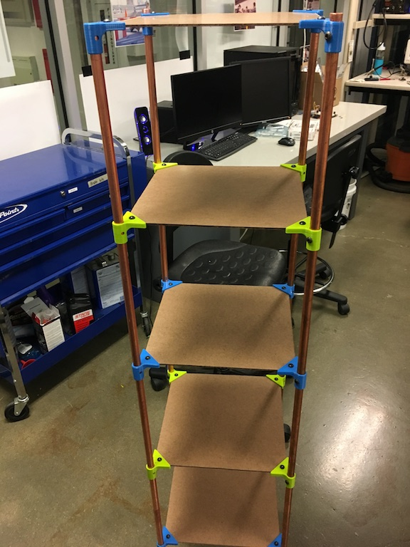

## Introduction
Shelves can be surprisingly expensive to buy online.  The cheapest ones I could find on Amazon were on the order of $30 and were only 3ft tall or so.  Being somewhat crafty, I thought I could do better with the added benefit of customizing the form factor and making the aesthetic match my taste preferences.  Here I detail how I you can make your own!  It's 5 feet tall with platforms every foot and the platforms are 1ft x 1ft.  It's surprisingly sturdy and cost around $20 to make.

## Shelf overview
The shelf is composed of 4 copper pipes which support the 5 wooden platforms.  The parts are joined together by 3D printed support brackets which are in turn fastened via 1/4" bolts.

It's quite sturdy - I have no qualms about it falling over and don't worry when I bump it, but it does rock for a couple seconds when perturbed.  It also deconstructs well due to the bolted nature (no glued joints) and can be easily transported as 4 rods, 5 12"x12" sheets, and a handful of 3D printed bits.  This was an important design consideration for me as a college student.  I use it next to my bed to hold things like my phone charger, bed lamp, book, etc. and it works a wonder.  Without further ado, let's get started!

## Bill of Materials
* 2x 10' copper pipe (1/2" diameter) - $7.82 each @ [Home Depot](https://www.homedepot.com/p/Cerro-1-2-in-x-10-ft-Copper-Type-M-Hard-Temper-Straight-Pipe-1-2-M-10/100354198)
* 5 ft2 wood board (I used some leftover from a 4'x8' "Eucaboard", but this can and should be customized to taste!) - $4.12 [Lauan Plywood](https://www.lowes.com/pd/1-4-in-Lauan-Plywood-Application-as-2-X-2/1000068901), $4.99 [Hardboard](https://www.homedepot.com/p/Hardboard-Tempered-Common-1-8-in-x-2-ft-x-4-ft-Actual-0-125-in-x-23-75-in-x-47-75-in-7005015/202088786), $3.72 [MDF board](https://www.homedepot.com/p/1-4-in-x-2-ft-x-2-ft-Medium-Density-Fiber-Board-1508102/205881910), $7.95 [MDF shelving](https://www.homedepot.com/p/3-4-in-x-11-1-4-in-x-8-ft-Shelving-MDF-Board-83224/302602708)
* 1/4"-20 x 3/8" machine screws/bolts (a smaller diameter would probably be cheaper, but I'm partial to 1/4") - $2.20 @ [BoltDepot](https://www.boltdepot.com/Machine_screws_Phillips_pan_head_Zinc_plated_steel_1_4-20.aspx)
* 20x 3D printed brackets (~250g of PLA: ~$5) *note: you might have to edit the sizing according to the thickness of your wood - [download STL file](shelfclip.stl) - [Autodesk File](http://a360.co/2FbyM3y)

## Construction
### Step 1: Print brackets
Although I'm sure there are abuntant options for how to fix the wood platforms to the copper pipe, 3D printing was an easy option for me since it's free and readily available on campus.  It took around 20 hours on an Ultimaker 3 and used around 250g, which, if you were printing at home, would probably cost ~$5.  I used a coarse .3mm layer height, supports, and no brim.  The design accounted for a ~.5mm sliding tolerance which seems pretty standard on most printers.  Ideally, they should have a transition fit around the copper pipe and a snug fit on the wood platforms.  You could probably also devise some cheaper ways to fasten these (i.e. drilling 1/2" holes in the platforms and finding a way to restrict wobble).

I'm also considering upgrading the brackets so that they can support pipe from the bottom and top both to allow for a more modular design where 1' sections of pipe can be stacked using the brackets.  I think the only downside here would be less wobble support, but the structure seems so solid after bolting the pipe to the brackets that I hardly think this will be a problem.

In any case, print the brackets and clean up the supports/brims.

<iframe src="https://myhub.autodesk360.com/ue2946219/shares/public/SH7f1edQT22b515c761e20d98898fa3fd386?mode=embed" width="320" height="240" allowfullscreen="true" webkitallowfullscreen="true" mozallowfullscreen="true"  frameborder="0"></iframe>

### Step 2: Cut and Drill copper pipes
Next, the copper pipes have to be cut to size.  Cut each pipe in half as best you can using a [pipe cutter](https://www.homedepot.com/p/HDX-Junior-Tube-Cutter-HDX003/204218579) or saw if you don't happen to have a pipe cutter.  File/sand the sharp edges.

Next, drill ~.22" holes along the pipe approximately every foot and starting from approximately the top (i.e. you want a platform at the very top and can leave the bottom bare because you don't need a platform on the floor).  Make sure to drill the holes as close as possible on the same side of the pipe so that the brackets will align and not be twisted along the pipe.  The solution I used was to tape a wrench (long, heavy object) to one side of the pipe as shown in the image below.  That way, the pipe would naturally roll so that the same side was always face down and I would always drill on the top side.  In a future iteration, I may make the hole in the bracket into a slot instead to allow some twist-tolerance.

Ideally, the holes would also be drilled with very consistent spacing on all 4 pipes, but I found that this was not nearly as critical as having the holes aligned in the twisting direction (which is very very critical!).

### Step 3: Drill wood platforms
Although the wood platforms should fit snugly into the brackets, it certainly makes the structure more secure and permanent to bolt/screw through the bracket/platform.  I fit the brackets into the corners of the platforms and drilled through the prescribed holes.

## Assembly
### Step 4: Secure brackets to pipes

I would definitely advise securing the brackets to the pipes before securing them to the platforms.  Slide the brackets into their proper positions.  I think it makes sense to have the pipe-support part of the bracket on the bottom so that the platforms are exerting compressive forces on the 3D printed parts, especially since the most logical way to print them causes their weak axis to be in the vertical direction.

Screw the brackets in to secure them.  A nut on the other side shouldn't be necessary since the holes should be tight, effectively tapped by the screws, and the screws are only undergoing shear forces.  Although the brackets have a hole on each side, I only used one and it seems plenty strong.

### Step 5: Secure platforms
Finally, slide the platforms into the brackets and fanagle all four poles around each platform.  It shouldn't be too difficult to align.  Push the brackets on as far as they'll go and insert the screws.  This may be difficult if the pipe holes were drilled slightly twisted along the pipe, but, depending on the hardness of your wood, forcing the screws in should be doable and I can't really thing of a much better solution.  If it's really difficult, you may opt to instead take out the brackets, screw the screw into the pipe alone, and allow the brackets to rest atop the screws.  This will give them rotational freedom with the downside of also giving them vertical freedom when unloaded.  I think this would significantly reduce stability depending on how tight-fitting your printer printed the brackets, but it may still work just fine.

## Conclusion

Hopefully, you now have a beautiful shelf to hold your goodies!  I've loved mine so far in terms of its utility, price, and portability.  It weighs probably less than 5 pounds in total while still being incredibly sturdy for a 5' tall shelf.  I keep this one next to my bed, but there's space for another and I have some extra 1'x1' wood panels and brackets so I plan on making another at some point.  This is probably one of the few projects I've done where I thought most things actually went quite well and I don't have major things I would change on the next iteration.  I already mentioned the modular/bidirectional bracket modification as well as the slotted bracket hole, but otherwise I'm very satisfied.  Let me know what you think in the comments section below!