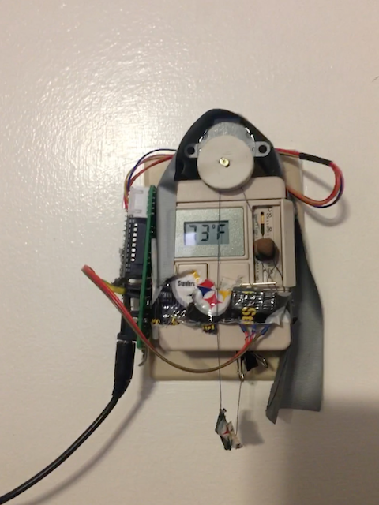
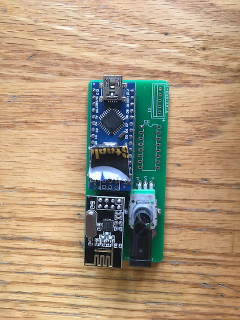

## Introduction
The thermostat in my room is placed in the most inconvenient place possible.  Because of this, I wanted to be able to make a "remote control" for my thermostat that's also IOT enabled so that it can automatically adjust the setpoint temperature based on my phone's location.

## Proof of Concept
As a proof of concept, I hacked together this system during an unusually non-busy weekend.

<iframe width="560" height="315" src="https://www.youtube.com/embed/Zt_jzfxKVHE" frameborder="0" allow="accelerometer; autoplay; encrypted-media; gyroscope; picture-in-picture" allowfullscreen></iframe>

I have since implemented limit switches and remote control using the nRF24L01 module.  The image on the left is a bit dilapidated at the moment.

## Next step
Next up is to make a "base station" that has real wifi and uses the nRF24 module to relay IoT commands to the thermostat.